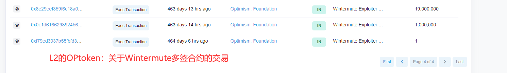
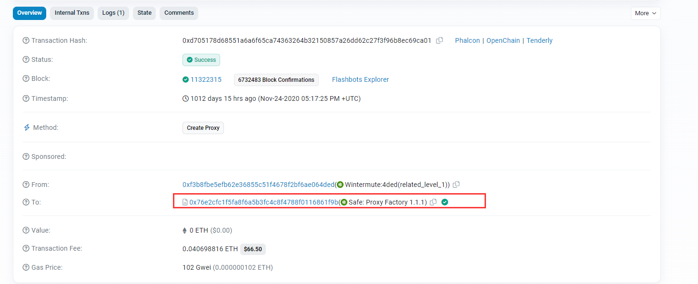
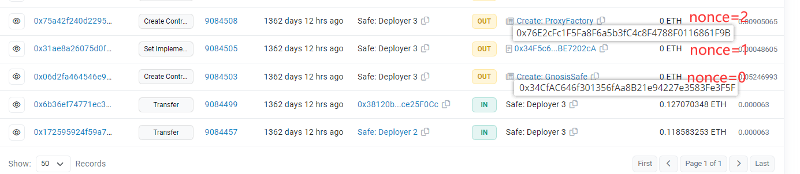
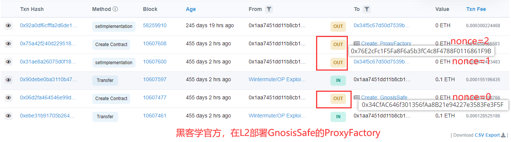
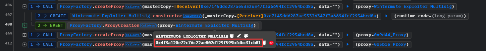
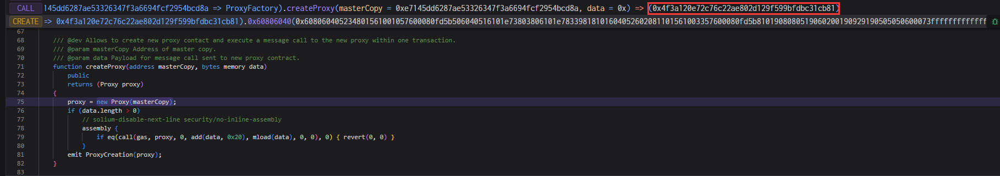
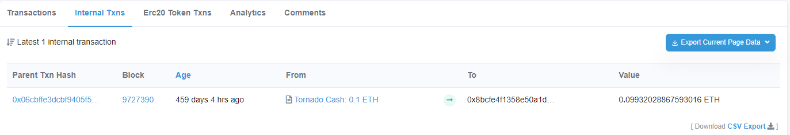

# Wintermute@txReplay@companyProbems

## 事件背景

Wintermute项目方发现他们无法控制本来应该属于他们的多签地址（持有20,000,000 OP）

- 时间：2022.06.08
- 损失金额：20,000,000 OP

## 交易

Wintermute项目方内部持有的地址：`0x1aa7451DD11b8cb16AC089ED7fE05eFa00100A6A`（Safe: Deployer 3）

- L1
  - Wintermute在Ethereum上的多签合约地址（Wintermute: Multisig，官方部署的）：[0x4f3a120E72C76c22ae802D129F599BFDbc31cb81](https://etherscan.io/address/0x4f3a120E72C76c22ae802D129F599BFDbc31cb81)
- L2
  - 地址
    - Wintermute的多签合约地址（Wintermute: Multisig，黑客部署的）：[0x4f3a120E72C76c22ae802D129F599BFDbc31cb81](https://etherscan.io/address/0x4f3a120E72C76c22ae802D129F599BFDbc31cb81)
    - Optimism基金会的多签合约地址（Wintermute: Multisig）：[0x2501c477D0A35545a387Aa4A3EEe4292A9a8B3F0](https://optimistic.etherscan.io/address/0x2501c477d0a35545a387aa4a3eee4292a9a8b3f0)
    - 黑客地址1：[0x60b28637879b5a09d21b68040020ffbf7dba5107](https://optimistic.etherscan.io/address/0x60b28637879b5a09d21b68040020ffbf7dba5107)
    - 黑客地址2：[0x8bcfe4f1358e50a1db10025d731c8b3b17f04dbb](https://optimistic.etherscan.io/address/0x8bcfe4f1358e50a1db10025d731c8b3b17f04dbb)
    - `_masterCopy`由黑客地址2部署：[0xe7145dd6287ae53326347f3a6694fcf2954bcd8a](https://optimistic.etherscan.io/address/0xe7145dd6287ae53326347f3a6694fcf2954bcd8a)
  - 交易
    - 黑客部署Wintermute: Multisig发起攻击：[0x00a3da68f0f6a69cb067f09c3f7e741a01636cbc27a84c603b468f65271d415b](https://optimistic.etherscan.io/tx/0x00a3da68f0f6a69cb067f09c3f7e741a01636cbc27a84c603b468f65271d415b)
    - 黑客部署`_masterCopy`：[0x69ee67800307ef7cb30ffa42d9f052290e81b3df6d3b7c29303007e33cd1c240](https://optimistic.etherscan.io/tx/0x69ee67800307ef7cb30ffa42d9f052290e81b3df6d3b7c29303007e33cd1c240)
    - Optimism基金会转1个op给Wintermute多签合约地址作为测试：[0xf79ed3037b55fbfd305007da2f19fb7960d31b8410453c679313e37a6d8548f4](https://optimistic.etherscan.io/tx/0xf79ed3037b55fbfd305007da2f19fb7960d31b8410453c679313e37a6d8548f4)
    - Optimism基金会转1,000,000个op给Wintermute多签合约地址：[0x0c1d6166293924566ea0ca32d07379c7033a8b8f2558f667f917543e51dd474a](https://optimistic.etherscan.io/tx/0x0c1d6166293924566ea0ca32d07379c7033a8b8f2558f667f917543e51dd474a)
    - Optimism基金会转19,000,000个op给Wintermute多签合约地址：[0x8e29eef359f6c18a06e229157d44467b5e873f6e5b996baa7124b38eb6dfb1db](https://optimistic.etherscan.io/tx/0x8e29eef359f6c18a06e229157d44467b5e873f6e5b996baa7124b38eb6dfb1db)

## 资金流向

[网站](https://optimistic.etherscan.io/token/0x4200000000000000000000000000000000000042?a=0x4f3a120E72C76c22ae802D129F599BFDbc31cb81)



## 攻击过程

1. Optimism官方想和Wintermute搞合作，因此委托Wintermute在L2（optimism）来做提供流动性的服务。
2. Optimism官方说会给他们20,000,000 OP来提供流动性，需要Wintermute给一个多签地址来接收这些代币。
3. Wintermute提供了一个多签地址X（这个地址在L1部署了，但是L2尚未部署，也就是无法控制）
4. 然后Optimism官方就转20,000,000 OP到这个多签地址X
5. 事后，Wintermute发现这个多签名地址X他们无法控制，并且已经被部署了：他们发现了被黑客攻击了，20,000,000 OP完全被黑客控制
6. 为了合作，Optimism官方再次发送了20,000,000 OP给Wintermute，并且Wintermute承认这完全是他们的过错。Wintermute给Optimism官方做出了赔偿，并且想办法和黑客交涉，但是黑客不打算偿还

## 攻击详细分析

从攻击过程可以得知，这是Wintermute项目方内部的问题：多签地址是他们提供的，然后有内鬼得知这个消息，并且知道这个多签地址在L2尚未部署，因此他可以抢先控制这个地址。20,000,000 OP转到这个多签地址之前，此合约尚未被部署，到账之后(2022.05.27)，内鬼部署和抢先控制这个多签地址(2022.06.05)。那么这个内鬼就是知道如何在L2部署相同的地址了，在L2部署和L1相同的地址（Wintermute提供的多签地址）。

那么此次攻击的核心就是：知道内部消息而抢先控制地址，和要懂得地址计算规则。那么接下来，我们就分析这个相同的多签地址是如何计算出来的。为了方便理解，我们将Wintermute提供的被黑的多签地址简写为`0x4f3`。

### 原理

Wintermute采用GnosisSafe的克隆合约模式，使用代理创建合约：使用CREATE进行部署，这就意味着地址计算原理是`keccak256(rlp(senderAddress, nonce))[12:31]`，仅仅和msg.sender和nonce有关，那么在任何一条EVM兼容链，只要msg.sender选择在相同的nonce部署合约，得到的地址就是一模一样的。

```solidity
	function createProxy(address masterCopy, bytes memory data)public returns (Proxy proxy){
        proxy = new Proxy(masterCopy);
        if (data.length > 0)
            // solium-disable-next-line security/no-inline-assembly
            assembly {
                if eq(call(gas, proxy, 0, add(data, 0x20), mload(data), 0, 0), 0) { revert(0, 0) }
            }
        emit ProxyCreation(proxy);
    }
```

### L1部署多签

我们来看一下在L1中，这个`0x4f3`是如何部署出来的：它是在[这笔交易](https://etherscan.io/tx/0xd705178d68551a6a6f65ca74363264b32150857a26dd62c27f3f96b8ec69ca01)中被部署出来，可以看出，他是使用GnosisSafe克隆合约的模式，产生多签地址。



然后继续[溯源](https://etherscan.io/txs?a=0x1aa7451dd11b8cb16ac089ed7fe05efa00100a6a)，看看是如何部署GnosisSafe的：从图中发现是使用Wintermute项目方持有的地址`0x1aa7`部署的



### L2控制多签

那么，如果想在L2复刻L1的地址，那么进行相同的操作即可：内鬼偷偷拿内部地址`0x1aa7`进行[部署](https://optimistic.etherscan.io/address/0x1aa7451DD11b8cb16AC089ED7fE05eFa00100A6A)GnosisSafe和ProxyFactory



然后[部署](https://optimistic.etherscan.io/tx/0x00a3da68f0f6a69cb067f09c3f7e741a01636cbc27a84c603b468f65271d415b)多签合约，控制该地址`0x4f3a`：因为不知道`0x4f3a`是ProxyFactory第几次部署的，内鬼也懒得数了，直接爆破，在其中某次createProxy中得到`0x4f3a`，并且因为是由黑客地址2部署的，因此多签信息都由他来设置。下面分别是[phalcon](https://explorer.phalcon.xyz/tx/optimism/0x00a3da68f0f6a69cb067f09c3f7e741a01636cbc27a84c603b468f65271d415b?line=0)和[tenderly](https://dashboard.tenderly.co/tx/optimistic/0x00a3da68f0f6a69cb067f09c3f7e741a01636cbc27a84c603b468f65271d415b?trace=0.135.0)的显示结果（phalcon无法查询地址，一行一行找半天服了）：





关于黑客地址2（`0xe7145dd6287ae53326347f3a6694fcf2954bcd8a`），他是在这个[交易](https://optimistic.etherscan.io/tx/0x69ee67800307ef7cb30ffa42d9f052290e81b3df6d3b7c29303007e33cd1c240)中部署的。黑客地址2的资金来源：混币器[Tornado.Cash](https://optimistic.etherscan.io/address/0x84443cfd09a48af6ef360c6976c5392ac5023a1f)。



## 复现

[github](https://github.com/chen4903/BlockChainPoC/tree/master/test)

```solidity
pragma solidity ^0.8.10;

import "forge-std/Test.sol";
import "./interface.sol";

//https://www.levi104.com/categories/08-PoC/

contract Attacker is Test {

    IProxyFactory proxy = IProxyFactory(0x76E2cFc1F5Fa8F6a5b3fC4c8F4788F0116861F9B);

    function setUp() public {
        vm.createSelectFork("optimism", 10_607_735);
    }

    function testExploit() public {
        // 爆破，得到多签地址`0x4f3a`
        address multiSigAddress;
        while (multiSigAddress != 0x4f3a120E72C76c22ae802D129F599BFDbc31cb81) {
            multiSigAddress = proxy.createProxy(0xE7145dd6287AE53326347f3A6694fCf2954bcD8A, "0x");
            console.log("multiSigAddress",multiSigAddress);
        }

        assertEq(multiSigAddress, 0x4f3a120E72C76c22ae802D129F599BFDbc31cb81);
    }

}
```

## 建议

- 项目方内部管理一定要清晰，杜绝内鬼
- 不要将资金打到一个无法控制的地址。此案例是地址尚未部署，没有真正控制，过于相信别人不知道这个多签地址


