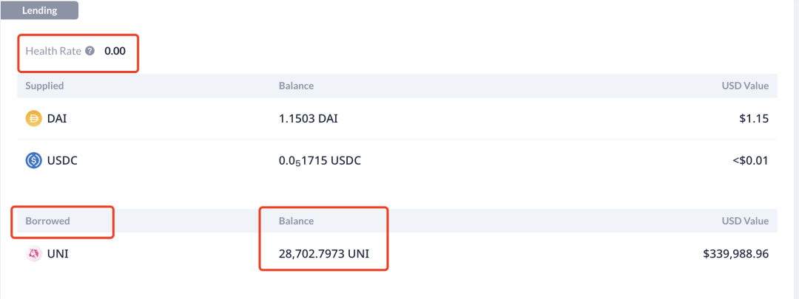
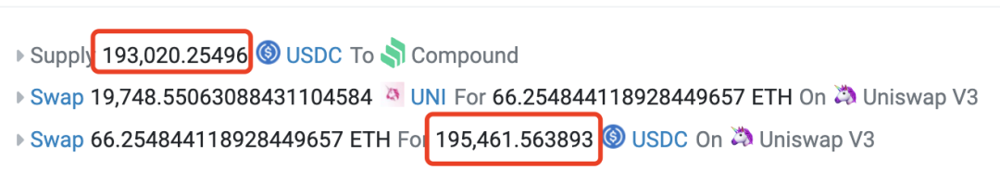
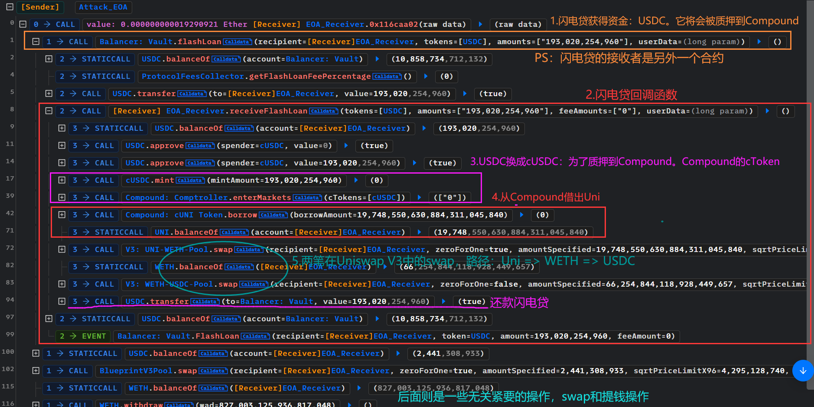

# Compound&Uni@Bad-Price

## Brief

2024.2.23日晚上22.26~23.00，uni瞬间拉盘，价格从7美元，一瞬间涨到了11美元。

compound这个借贷协议是允许用户抵押其他币（如usdc）借uni，就在这个uni瞬间拉盘之后的一小段时间里，compound没有及时更新uni的价格，导致在协议里可以用低uni价值的抵押品去借走uni。

这被极少数几个人发现后抵押usdc借走了大量的uni，然后卖掉uni变成usdc，然后你会发现，它获得的usdc数量竟然多于他抵押进compound的数量。

## Analysis

我来认真分析一下这次对借贷协议的攻击，数据来源https://bad-debt.riskdao.org/。

攻击获利的地址有下面四个

- [0x6980a47bee930a4584b09ee79ebe46484fbdbdd0](https://etherscan.io/address/0x6980a47bee930a4584b09ee79ebe46484fbdbdd0)
- [0x5968ada261a84e19a6c85830e655647752585ed4](https://etherscan.io/address/0x5968ada261a84e19a6c85830e655647752585ed4)
- [0x49bc3cec1fb7978746f742a4e485d0d601831cea](https://etherscan.io/address/0x49bc3cec1fb7978746f742a4e485d0d601831cea)
- [0x2f99fb66ea797e7fa2d07262402ab38bd5e53b12](https://etherscan.io/address/0x2f99fb66ea797e7fa2d07262402ab38bd5e53b12)

现在在[debank](https://debank.com/profile/0x6980a47bee930a4584b09ee79ebe46484fbdbdd0)上去查看这四个地址的余额，你会发现在compound这个协议里，这四个地址都有一笔债务，但抵押品几乎为零，如下面：

这个截图显示，这个地址0x2f99fb66ea797e7fa2d07262402ab38bd5e53b12在compound抵押了1.1503Dai和0.051715usdc，但借走了28702.7973uni 。

抵押品几乎为0，但借走的uni价值高达 33万U。这种情况下，这个地址肯定是不会去还这笔uni债务的。其他三个地址都一样，使用了几乎为零的抵押品，借走了十几万U的uni币。这四个地址累计借走了 55,565.9001uni，目前按12U一个计算，总价值是 55565.9*12=666790.8 usdt，66万U亏损。

## Attack Logic

为什么会发生可以使用几乎为0抵押品，却能借卖几十万U的uni币？

整个攻击逻辑是下面这样的：

1.假设现在是T0时间点，uni在市场上的价格是7U/uni，compound对uni的喂价正常，也是7U/uni

2.然后在T1时间点，uni在市场上的价格突然爆涨，瞬间涨到了11U/uni。但compound里对uni的喂价出现错误，还是停留在7U/uni。

3.然后有人发现了compound对uni的喂价错误，立刻抵押了20万usdc进去compound充当抵押品，并顶格借走了uni币，按compound的喂价（7u/uni，和85%的借贷率），可以借走 20*0.85=17 万U的uni， 170000/7=24285.7143 uni，即可以借走 2.4万uni。

4.然后将这2.4万uni在市场上（比如uniswap v3）卖掉换成usdc，因为市场上的价格是 11U/uni，因此可以卖到 2.4*11=26.4 wUsdc，比抵押品多了 6.4万Usdc，这就是利润。

下面这笔[交易](https://etherscan.io/tx/0xaee0f8d1235584a3212f233b655f87b89f22f1d4890782447c4ef742b37af58d)，可以非常清晰地看到上面的逻辑

它抵押了 193020usdc，借出了19748uni，并且将uni卖成了ETH然后ETH又卖成了usdc，最终收到195461usdc，比抵押品多了195461-193020=2441 usdc。

5.等compound将正确的uni币价格喂进协议后，那这些债务肯定要被清算，并且还清算不干净，即使清算者拿走所有的抵押品，也还会留下大量的uni债务。这就是坏账。

## Code

## Other

compound为什么会出现uni价格喂价错误？

因为compound对uni币的价格设定是采用了双重保险，一个是采用chainlink的oracle喂价，另外同时还采用了Uniswap TWAP（时间加权平均价格）。但这两个喂价具体是怎么取舍我没去查。但从现在的结果来看，这两者必须同时正常，compound才能正常喂价。

在uni价格瞬间爆涨时，chainlink的喂价是正常的，但UniswapTWAP的价格出现了问题，compound的协议给出了错误的价格。

> 目前compound已经发起了修正这个bug的投票。

## POC

https://github.com/chen4903/BlockChainPoC/blob/master/test/PoC/17.Comp-Uni%40bad-price.sol
